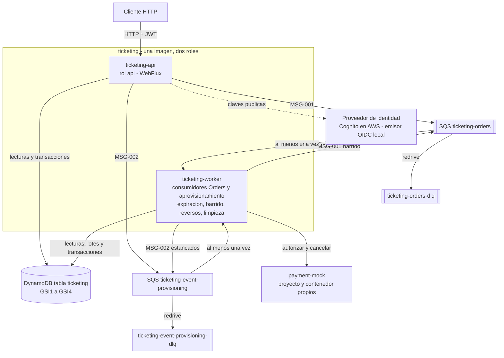

[Español](README.md) · **English**

# Ticketing Event Processing Platform

Reactive ticketing backend (Java 25, Spring Boot 4, WebFlux) on DynamoDB and SQS, with an independent Payment Mock and a complete local environment on Docker Compose. It reserves between 1 and 10 Tickets atomically, answers without waiting for the payment and processes the purchase asynchronously without overselling.

| If you want to… | Go to |
|---|---|
| Start the environment | [Prerequisites](#5-prerequisites) → [Configuration](#6-configuration) → [Quick start](#7-quick-start-with-docker-compose) |
| Demonstrate the flows | [Tokens](#9-local-identities-and-tokens) → [Payment Mock](#10-payment-mock-control) → [API and examples](#11-api-and-examples) → [Collection](#12-request-collection) |
| Evaluate the design | [Status](#2-implementation-and-verification-status) → [Decisions](#14-architecture-decisions-and-trade-offs) → [Limitations](#19-known-limitations) → [Production](#20-production-changes) |

## 1. Purpose and scope

**Problem.** During demand peaks the previous system sold the same seat to several people, duplicated purchases and timed out. **Solution.** A reactive API accepts the purchase, reserves the Tickets with a single conditional write and answers immediately with the Order identifier; a `worker` process charges through the Payment Mock and closes the Order asynchronously.

Domain terms:

| Term | Meaning |
|---|---|
| Event | Event with name, venue, date (`startsAt`), capacity (at most 50,000) and a compact inventory definition. It is provisioned asynchronously: `PROVISIONING` → `ENABLED` or `FAILED`. Only an `ENABLED` Event is visible and on sale |
| Ticket | Individual seat `<section>-<row>-<seat>` with exactly one state: `AVAILABLE`, `RESERVED`, `PENDING_CONFIRMATION`, `SOLD` (final) or `COMPLIMENTARY` (final, not a sale) |
| Order | Purchase of 1 to 10 Tickets of the same Event, all or nothing. States: `CREATED`, `CONFIRMED`, `REJECTED`, `FAILED`, `EXPIRED` |
| Reservation | Hold of the Tickets of an Order for at most 10 minutes (`reservationExpiresAt`) |
| PaymentAttempt | Charge attempt `<orderId>-1`, idempotent and cancellable at the Payment Mock |

Excluded (specification v5 §3.2): frontend, login screens, reports, streaming availability, real payment provider and enabling or modifying an already enabled Event.

## 2. Implementation and verification status

Every statement in this repository carries one of these labels, identical in both languages:

| Label | Meaning |
|---|---|
| `Implemented and verified` | Built and checked with reproducible evidence |
| `Implemented, verification pending` | Implemented; the stated verification is missing |
| `Designed, not implemented` | Designed and approved, not implemented |
| `Optional / differential` | Optional or differential value |
| `Out of scope` | Outside the approved scope |
| `Known limitation` | Known and accepted limitation |
| `NOT_YET_VALIDATED_BY_QA` | Documented procedure not yet validated by the QA agent |

| Component | Status | Evidence |
|---|---|---|
| API `API-001` to `API-006` (`api` role) | `Implemented and verified` | INC-008 and INC-010: web tests validated against OpenAPI v2 |
| Consumers and periodic processes (`worker` role) | `Implemented and verified` | INC-009 and INC-010: per-role tests inside the JVM |
| Payment Mock `API-101` to `API-111` | `Implemented and verified` | PM-INC-006 and DOC-INC-002: 256 green tests |
| Docker Compose environment (7 services and `load` profile) | `Implemented and verified` | PLAT-INC-007 and DOC-INC-002: clean start and verifiers without failures |
| Unit tests and 90 % coverage gate | `Implemented and verified` | DOC-INC-002: 770 tests, 99.49 % of lines |
| Integration tests against the emulators | `Implemented and verified` | INC-010: 129 `*IT` tests (not re-run) |
| Backend closure (INC-011) | `Implemented, verification pending` | Not executed (DOC-ISSUE-005) |
| Demonstration collection `postman/ticketing-demo.*` | `Implemented and verified` | DOC-INC-003: newman 5.3.2, default run and slow scenarios without failures |
| End to end of MF-001 to MF-004 on Compose | `NOT_YET_VALIDATED_BY_QA` | Demonstration with the collection only (DOC-ISSUE-006) |
| Resilience scenarios of ADR-038 | `NOT_YET_VALIDATED_BY_QA` | Procedures in `docs/resilience.md`; commands run in DOC-INC-005, without QA validation (DOC-ISSUE-006) |
| Load test (AC-029 to AC-031) | `Designed, not implemented` | The `load-test` service fails on purpose until QA delivers its harness (DOC-ISSUE-006) |
| AWS topology and Terraform (EVAL-011, EVAL-012) | `Designed, not implemented` | Design in the architecture; no infrastructure code |

## 3. Architecture at a glance



- **One image, two roles.** `ticketing-api` serves `API-001` to `API-006`; `ticketing-worker` consumes the Orders and provisioning queues and runs four periodic processes: expiration (every 5 s), republish sweep, payment reversals and provisioning cleanup.
- **DynamoDB, one table.** Each Ticket in its own partition; four sparse indexes (`GSI1` Events by status, `GSI2` available Tickets with sharding, `GSI3` expiration and reversal work, `GSI4` Orders pending enqueue).
- **SQS Standard** with a DLQ for Orders and for provisioning; at-least-once delivery with application idempotency.
- **Payment Mock** as an independent project and container, driven by rules; mandatory cancellation for reversals.
- **Clean Architecture** with Maven modules `domain`, `application`, `infrastructure` and `bootstrap`; forbidden dependencies do not compile (ADR-034).

Diagram labels are in Spanish, as in the approved architecture. Context, sequences of each flow and AWS topology (Spanish) in [`docs/diagrams.md`](docs/diagrams.md); decision guide (Spanish) in [`docs/architecture.md`](docs/architecture.md).

## 4. Repository layout

| Folder | Content |
|---|---|
| `ticketing/` | Backend (Maven multi-module: `domain`, `application`, `infrastructure`, `bootstrap`). One jar, two roles: `api` and `worker`. |
| `payment-mock/` | Independent Payment Mock (own Maven build), contract `payment-mock.openapi.v1.yaml`. |
| `platform/` | `infra-init` (table, indexes, queues), `local-idp` (local OIDC issuer with the five test identities) and verification scripts. |
| `postman/` | Postman collections and their environments. |
| `docs/` | Detailed documentation (in Spanish). |
| `docker-compose.yml` | DynamoDB Local, LocalStack (SQS), `infra-init`, `local-idp`, `payment-mock`, `ticketing-api` and `ticketing-worker` (same image, role by `TICKETING_ROLE`). Profile `load`: `load-token-generator` and `load-test`. |

## 5. Prerequisites

| Tool | What for | Verified version |
|---|---|---|
| Docker with Compose v2 | The whole environment. Enough to start it: the image builds compile and run the tests inside Docker | Docker 29.8.0, Compose v5.5.1 |
| Git | Clone the repository | 2.39.2 |
| `bash` and `curl` (Git Bash on Windows) | `platform/verify` verifiers, `curl` examples, `run-local.sh` | bash 5.2.12, curl 7.87.0 |
| JDK 25 | Build and tests outside Docker (§13) and local JVM mode (§21) | OpenJDK 25.0.4.1 (Zulu 25.36.205) |
| Node.js and newman | Run the collection from the command line (optional) | Node.js 14.21.3, newman 5.3.2 |
| PowerShell | Alternative to the `sh` blocks where the syntax differs | Windows PowerShell 5.1 |

On Windows, clone into a short folder (the longest tracked path has 141 characters) or enable long paths first: `git config --global core.longpaths true` (DOC-ISSUE-002). At rest the whole environment uses about 1 GiB of memory (PLAT-INC-007).

## 6. Configuration

```sh
cp .env.example .env
# Set PAYMENT_MOCK_API_KEY to any value. If a host port is busy, change its *_HOST_PORT
# (e.g. PAYMENT_MOCK_HOST_PORT=18090, TICKETING_API_HOST_PORT, TICKETING_API_MANAGEMENT_HOST_PORT).
```

```powershell
Copy-Item .env.example .env
# Then edit .env: set PAYMENT_MOCK_API_KEY and, if a host port is busy, its *_HOST_PORT value.
```

| Variable | Purpose | Required |
|---|---|---|
| `PAYMENT_MOCK_API_KEY` | Secret shared by `payment-mock` and `ticketing-worker`. Compose does not start without it | Yes |
| `AWS_REGION`, `AWS_ACCESS_KEY_ID`, `AWS_SECRET_ACCESS_KEY` | **Fictitious** credentials, valid only against the emulators | Yes (provided in `.env.example`) |
| `*_HOST_PORT` | Host ports, always on `127.0.0.1` (defaults 8080, 8081, 8090, 9000, 8000, 4566) | No |
| `LOCAL_IDP_*`, `TICKETING_WORKER_ID`, `LOAD_TOKEN_*` | Local issuer, `worker` identifier and load profile | No |

`.env` is not versioned; `.env.example` only holds fictitious values. Full table (Spanish), including the variables Compose passes to the application, in [`docs/operations.md`](docs/operations.md#2-variables-de-env).

The backend reads its configuration from environment variables (`TICKETING_ROLE=api|worker`, `TICKETING_DYNAMODB_TABLE`, `TICKETING_SQS_*_QUEUE_URL`, `TICKETING_SECURITY_*`, `TICKETING_PAYMENT_*`, …). `run-local.sh` shows the complete local set. AWS credentials are read through the standard SDK chain; the values in `.env.example` are fictitious and only valid against the local emulators.

## 7. Quick start with Docker Compose

From the repository root:

```sh
docker compose up -d --wait     # builds the ticketing image (runs the unit test suite) and starts all services
docker compose ps -a            # 6 services healthy and infra-init "Exited (0)"
docker compose logs -f ticketing-api ticketing-worker   # structured JSON logs (Ctrl+C to leave)
```

The first `up` builds the images, with their tests, in about 2 minutes (PLAT-INC-007); with the images already built it takes about 25 seconds (24.8 s measured in DOC-INC-002). Start order: emulators, local issuer and Payment Mock; then `infra-init` creates the table and the queues; finally `ticketing-api` and `ticketing-worker`, from the same image. The api is published on `127.0.0.1:8080` (API) and `127.0.0.1:8081` (management); the worker publishes no ports.

Stop and clean up:

```sh
docker compose stop             # graceful stop; emulator data is lost on the next start
docker compose down             # removes containers and network (data is ephemeral)
docker compose down -v          # also removes the load profile volume (load-tokens)
```

The emulators keep no data on disk: after `stop` and a new `up -d --wait`, `infra-init` recreates the table and the queues empty (verified: stop in 7.2 s and new start in 28 s). `down -v` only affects this project. Details of each command (Spanish) in [`docs/operations.md`](docs/operations.md#4-ciclo-de-vida).

## 8. Environment verification

```sh
bash platform/verify/environment.sh   # exit code = number of failed checks
curl -s http://localhost:8080/readyz  # {"status":"UP"}
curl -s -o /dev/null -w '%{http_code}\n' http://localhost:8090/health   # 200; use your PAYMENT_MOCK_HOST_PORT
MSYS_NO_PATHCONV=1 docker compose run --rm --no-deps -v ./platform/verify:/verify:ro --entrypoint sh infra-init /verify/resources.sh
```

| Check | Result in DOC-INC-002 |
|---|---|
| `environment.sh`: topology, health, ports on `127.0.0.1`, hardening, pinned images, no secrets | 65 passed, 0 failed |
| `resources.sh`: `ticketing` table, `GSI1` to `GSI4`, TTL and the four queues with their redrive | 38 passed, 0 failed |
| Health: `:8080/readyz`, `:8080/livez`, `:8081/actuator/health`, `:8090/health`, discovery and JWKS of `:9000` | 200 |
| `/actuator/**` on the public port 8080 | 401 (management only on port 8081) |

`MSYS_NO_PATHCONV=1` is only needed in Git Bash. Metrics on the management port: `GET :8081/actuator/prometheus`. Identity verifier and other details (Spanish) in [`docs/operations.md`](docs/operations.md#5-verificadores).

## 9. Local identities and tokens

`local-idp` issues RS256 tokens shaped like Cognito's (`sub`, `cognito:groups`, `token_use=access`, `client_id`, `iss`, `exp`). It is local only and asks for no credentials.

| Identity | Groups | Use in the demonstration |
|---|---|---|
| `admin` | `ADMIN` | Create Events and check their provisioning |
| `customer-a`, `customer-b` | `CUSTOMER` | Buy and check that another customer's Order is not revealed |
| `admin-customer` | `ADMIN`, `CUSTOMER` | An `ADMIN` who can also buy |
| `no-groups` | None | Gets 403 on every protected operation |
| `sub=<id>&groups=CUSTOMER` | `CUSTOMER` | Arbitrary subjects: each one has its own purchase rate limit |

```sh
# Access token for one of the identities: admin, customer-a, customer-b, admin-customer, no-groups
curl -s -X POST http://localhost:9000/token -d identity=admin
# Keep tokens in shell variables instead of printing them
ADMIN_TOKEN=$(curl -s -X POST http://localhost:9000/token -d identity=admin | sed -E 's/.*"access_token" *: *"([^"]+)".*/\1/')
CUSTOMER_TOKEN=$(curl -s -X POST http://localhost:9000/token -d identity=customer-a | sed -E 's/.*"access_token" *: *"([^"]+)".*/\1/')
# Arbitrary CUSTOMER subject
BUYER_TOKEN=$(curl -s -X POST http://localhost:9000/token -d 'sub=demo-buyer-1&groups=CUSTOMER' | sed -E 's/.*"access_token" *: *"([^"]+)".*/\1/')
```

```powershell
$ADMIN_TOKEN = (Invoke-RestMethod -Method Post -Uri http://localhost:9000/token -Body @{ identity = 'admin' }).access_token
$CUSTOMER_TOKEN = (Invoke-RestMethod -Method Post -Uri http://localhost:9000/token -Body @{ identity = 'customer-a' }).access_token
```

Tokens last 3,600 s and their `iss` is always `http://local-idp:9000`, also when requested from the host. Restarting `local-idp` changes the signing key and invalidates earlier tokens. In PowerShell 5.1, `curl` is an alias of `Invoke-WebRequest`: use `curl.exe` or the cmdlets.

## 10. Payment Mock control

The payment outcome is chosen only with Payment Mock rules, never with a field of the purchase (AV-004). Before a decline, failure or latency scenario: reset the mock, create the rule, run the purchase and inspect the result. The mock state lives in memory and is lost when it restarts.

```sh
PAYMENT_MOCK_API_KEY=$(grep '^PAYMENT_MOCK_API_KEY=' .env | cut -d= -f2- | tr -d '\r')
MOCK_URL=http://localhost:$(grep '^PAYMENT_MOCK_HOST_PORT=' .env | cut -d= -f2 | tr -d '\r')
curl -s -o /dev/null -w '%{http_code}\n' -X POST "$MOCK_URL/control/reset" -H "X-Api-Key: $PAYMENT_MOCK_API_KEY"   # 204
curl -s -X PUT "$MOCK_URL/control/defaults" -H "X-Api-Key: $PAYMENT_MOCK_API_KEY" \
  -H 'Content-Type: application/json' -d '{"defaultOutcome":"APPROVED","declinePercentage":0}'
# Decline every payment of one buyer: customerRef is the JWT subject of the buyer
curl -s -X POST "$MOCK_URL/control/rules" -H "X-Api-Key: $PAYMENT_MOCK_API_KEY" \
  -H 'Content-Type: application/json' -d '{"match":{"customerRef":"demo-buyer-1"},"behaviour":{"type":"DECLINE"}}'
curl -s "$MOCK_URL/control/rules" -H "X-Api-Key: $PAYMENT_MOCK_API_KEY"
```

```powershell
$PAYMENT_MOCK_API_KEY = ((Get-Content .env | Select-String '^PAYMENT_MOCK_API_KEY=').Line -split '=', 2)[1]
$MOCK_URL = 'http://localhost:' + ((Get-Content .env | Select-String '^PAYMENT_MOCK_HOST_PORT=').Line -split '=', 2)[1]
Invoke-WebRequest -UseBasicParsing -Method Post -Uri "$MOCK_URL/control/reset" -Headers @{ 'X-Api-Key' = $PAYMENT_MOCK_API_KEY }
```

| Operation | Use |
|---|---|
| `API-110` `POST /control/reset` | Clears rules, defaults, authorizations and cancellations (204) |
| `API-107` `PUT /control/defaults` | Default outcome and deterministic decline percentage |
| `API-104` `POST /control/rules`, `API-103` `GET /control/rules` | Create and list rules. A single matcher per rule, with precedence `orderId`, `ticketId`, `customerRef`, `eventId` |
| `API-106` `DELETE /control/rules/{ruleId}`, `API-105` `DELETE /control/rules` | Delete one rule or all of them (204) |
| `API-108` `GET /control/authorizations/{paymentAttemptId}` | Authorizations received for `<orderId>-1` (404 if none) |
| `API-109` `GET /control/cancellations/{paymentAttemptId}` | Cancellations (reversals) received (404 if none) |
| `API-111` `GET /health` | Health, no API key |
| `API-101` `POST /payments`, `API-102` `POST /payments/{paymentAttemptId}/cancellation` | Used by the `worker`; not called by hand in the demonstration |

| Rule behaviour | Expected effect on the Order (ADR-030) |
|---|---|
| `APPROVE` / `DECLINE` | `CONFIRMED` / `REJECTED` with `PAYMENT_DECLINED` |
| `DEFINITIVE_ERROR` | The mock answers 422; the Order ends `FAILED` with `PROCESSING_FAILED`, without reversal |
| `TRANSIENT_THEN_OUTCOME` | N 503 answers and then `finalOutcome`; the `worker` retries with the same `paymentAttemptId` |
| `LATENCY` | Delay of `addedLatencyMs` (up to 60,000 ms); more than 3,000 ms exceeds the `worker` timeout |

Every control operation requires the `X-Api-Key` header (401 without it). Contract: [`payment-mock.openapi.v1.yaml`](ticketing/infrastructure/src/test/resources/contracts/payment-mock.openapi.v1.yaml).

## 11. API and examples

| ID | Method and path | Role | Main responses |
|---|---|---|---|
| `API-001` | `POST /api/v1/events` (`Idempotency-Key`) | `ADMIN` | 202 `PROVISIONING` with `Location`; 200 replay; 400; 422 `IDEMPOTENCY_KEY_REUSED` |
| `API-002` | `GET /api/v1/events` | `ADMIN` or `CUSTOMER` | 200 future `ENABLED` Events with `soldOut`, cursor paginated |
| `API-003` | `GET /api/v1/events/{eventId}/availability` | `ADMIN` or `CUSTOMER` | 200 `availableCount` and a page of `AVAILABLE` Tickets; 400 invalid cursor or section; 404 |
| `API-004` | `POST /api/v1/orders` (`Idempotency-Key`) | `CUSTOMER` | 201 `CREATED` without waiting for the payment; 200 replay; 409 `TICKETS_UNAVAILABLE`, `ACTIVE_ORDER_EXISTS`, `EVENT_NOT_ON_SALE`; 422; 429; 503 |
| `API-005` | `GET /api/v1/orders/{orderId}` | owner `CUSTOMER` | 200 status and functional cause; the same 404 for another customer's, missing or malformed Order |
| `API-006` | `GET /api/v1/events/{eventId}/provisioning` | `ADMIN` | 200 `PROVISIONING`, `ENABLED` or `FAILED` with progress |

Full contract: [`ticketing.openapi.v2.yaml`](ticketing/infrastructure/src/test/resources/contracts/ticketing.openapi.v2.yaml), a SHA-256 verified copy of the approved contract. Errors are Problem Details (`application/problem+json`) with a stable `code` and a `traceId`.

Walk through MF-001 to MF-004 with `curl`, from Git Bash, Linux or macOS (in PowerShell, use the collection of §12). The block creates its own Event and its own `CUSTOMER` subject:

```sh
API=http://localhost:8080/api/v1
token() { curl -s -X POST http://localhost:9000/token -d "$1" | sed -E 's/.*"access_token" *: *"([^"]+)".*/\1/'; }
ADMIN_TOKEN=$(token identity=admin)
CUSTOMER_TOKEN=$(token identity=customer-b)
BUYER_TOKEN=$(token "sub=demo-buyer-$(date +%s)&groups=CUSTOMER")
STARTS_AT=$(date -u -d '+30 days' +%Y-%m-%dT%H:%M:%SZ)   # GNU date; on macOS: date -u -v+30d +%Y-%m-%dT%H:%M:%SZ

# MF-001: create an Event (202, PROVISIONING) and poll its provisioning status until ENABLED
EVENT_ID=$(curl -s -X POST "$API/events" -H "Authorization: Bearer $ADMIN_TOKEN" -H 'Content-Type: application/json' \
  -H "Idempotency-Key: evt-readme-$(date +%s)" \
  -d "{\"name\":\"Concert\",\"venue\":\"Arena\",\"startsAt\":\"$STARTS_AT\",\"capacity\":12,
       \"inventory\":{\"sections\":[{\"code\":\"A\",\"rows\":[{\"label\":\"1\",\"seats\":10}]},{\"code\":\"VIP\",\"rows\":[{\"label\":\"1\",\"seats\":2}]}],
       \"complimentary\":[{\"section\":\"VIP\",\"row\":\"1\",\"fromSeat\":1,\"toSeat\":2}]}}" \
  | sed -E 's/.*"eventId" *: *"([^"]+)".*/\1/')
for i in $(seq 1 30); do
  STATUS=$(curl -s "$API/events/$EVENT_ID/provisioning" -H "Authorization: Bearer $ADMIN_TOKEN" | sed -E 's/.*"provisioningStatus" *: *"([^"]+)".*/\1/')
  [ "$STATUS" != PROVISIONING ] && break; sleep 1
done; echo "provisioning: $STATUS"   # ENABLED

# MF-002: list future Events (soldOut flag) and read one availability page of section A
curl -s "$API/events?limit=20" -H "Authorization: Bearer $BUYER_TOKEN"; echo
curl -s "$API/events/$EVENT_ID/availability?section=A&pageSize=5" -H "Authorization: Bearer $BUYER_TOKEN"; echo

# MF-003: start a purchase (201 CREATED without waiting for the payment) and poll the Order
ORDER_ID=$(curl -s -X POST "$API/orders" -H "Authorization: Bearer $BUYER_TOKEN" -H 'Content-Type: application/json' \
  -H "Idempotency-Key: ord-readme-$(date +%s)" -d "{\"eventId\":\"$EVENT_ID\",\"ticketIds\":[\"A-1-1\",\"A-1-2\"]}" \
  | sed -E 's/.*"orderId" *: *"([^"]+)".*/\1/')
for i in $(seq 1 30); do
  STATUS=$(curl -s "$API/orders/$ORDER_ID" -H "Authorization: Bearer $BUYER_TOKEN" | sed -E 's/.*"status" *: *"([^"]+)".*/\1/')
  case "$STATUS" in CONFIRMED|REJECTED|FAILED|EXPIRED) break ;; esac; sleep 1
done; echo "order: $STATUS"   # CONFIRMED with the default Payment Mock outcome

# MF-004: the owner reads the Order; another customer gets the same 404 as for a missing Order
curl -s "$API/orders/$ORDER_ID" -H "Authorization: Bearer $BUYER_TOKEN"; echo
curl -s -o /dev/null -w '%{http_code}\n' "$API/orders/$ORDER_ID" -H "Authorization: Bearer $CUSTOMER_TOKEN"   # 404
```

Two ideas this walk makes visible: creating an Event and buying are **asynchronous** (immediate 202 and 201, final status by polling), and availability is **informative**: it reserves nothing and the purchase validates every Ticket again. Verified in DOC-INC-003: `ENABLED`, `CONFIRMED` and 404 for the other customer.

## 12. Request collection

**Main demonstration collection (`DEL-004`):** `postman/ticketing-demo.postman_collection.json` with the environment `postman/ticketing-demo.postman_environment.json`. It covers MF-001 to MF-005, deterministic decline and failures by configuring the Payment Mock first, idempotency, active Order, security, 413 and 429.

1. Import both files into Postman and select the **Ticketing demo (local)** environment.
2. Write the `PAYMENT_MOCK_API_KEY` value of your `.env` into `paymentMockApiKey` (empty in the versioned file) and adjust `paymentMockUrl` if you changed the port.
3. Run folders **00 to 08 and 99**, in order, with the Collection Runner (about 12 s). Folder **09** holds slow scenarios (transient redelivery, MF-005 reversal and past Event; about 3 minutes in total) and runs separately.

From the command line, with newman 5.3.2:

```sh
PAYMENT_MOCK_API_KEY=$(grep '^PAYMENT_MOCK_API_KEY=' .env | cut -d= -f2- | tr -d '\r')
newman run postman/ticketing-demo.postman_collection.json -e postman/ticketing-demo.postman_environment.json \
  --env-var paymentMockUrl=http://localhost:8090 --env-var "paymentMockApiKey=$PAYMENT_MOCK_API_KEY" \
  --folder "00 Entorno y salud" --folder "01 Control del Payment Mock" --folder "02 Aprovisionamiento de Event (MF-001)" \
  --folder "03 Catálogo y disponibilidad (MF-002)" --folder "04 Compra confirmada (MF-003, MF-004)" \
  --folder "05 Pago rechazado (AC-020)" --folder "06 Comportamientos de fallo" --folder "07 Idempotencia y Order activa" \
  --folder "08 Seguridad y propiedad" --folder "99 Limpieza"
```

| Verified run | Executed requests | Assertions | Failures |
|---|---|---|---|
| Default folders, first run (DOC-INC-003) | 95 | 243 | 0 |
| Default folders, second run in a row | 95 | 243 | 0 |
| Default folders after `down -v` and `up -d --wait` (DOC-INC-006) | 96 | 244 | 0 |
| Folders 00 to 02, 09 and 99 (slow scenarios, 3 min 8 s; DOC-INC-003) | 208 | 226 | 0 |

Executed requests include the polling repetitions, so the counts vary slightly between runs. Each run creates its own Event, subjects and rules, so it does not depend on earlier runs; folder 99 clears the tokens from the collection. The collection demonstrates the flows and replaces neither the automated tests nor QA validation. Folder by folder details, variables and what it does not demonstrate (Spanish): [`docs/collection-guide.md`](docs/collection-guide.md).

**Previous collection:** `postman/ticketing.postman_collection.json` and `postman/ticketing-local.postman_environment.json`, created by the author before this documentation, are kept unchanged. They cover the happy path and several errors; their differences with the main one (Spanish) are in [`docs/collection-guide.md`](docs/collection-guide.md#9-colección-previa).

## 13. Build and tests

```sh
cd ticketing
./mvnw verify                  # unit, architecture, blocking detector and 90 % coverage gate (no Docker)
./mvnw verify -Pintegration    # adds the integration tests against DynamoDB Local and LocalStack (Docker)

cd ../payment-mock
./mvnw verify
```

`./mvnw` needs JDK 25: set `JAVA_HOME` for the invocation if your default JDK is another one. In PowerShell use `.\mvnw.cmd verify`.

| Command | Directory | Result | Source |
|---|---|---|---|
| `./mvnw verify` | `ticketing/` | 770 tests (domain 99, application 277, infrastructure 369, bootstrap 24, gate 1), 0 failures; aggregate line coverage 99.49 % (5,505 of 5,533) with the 90 % gate green; 1 min 47 s | DOC-INC-002, revision `90f8ed2` |
| `./mvnw verify -Pintegration` | `ticketing/` | Additionally 129 `*IT` tests against DynamoDB Local and LocalStack, 0 failures; about 4 min 14 s | INC-010, revision `69a2c23` (not re-run by human decision) |
| `./mvnw verify` | `payment-mock/` | 256 tests, 0 failures; 35 s | DOC-INC-002, revision `90f8ed2` |

Coverage is measured on `domain`, `application` and `infrastructure` of `ticketing`, with container-free tests only (ADR-038); `payment-mock` keeps its tests without a gate. The request collection demonstrates the flows; it replaces neither these tests nor QA validation.

## 14. Architecture decisions and trade-offs

| Problem | Decision | Discarded alternative | Accepted consequence | ADR |
|---|---|---|---|---|
| Hot partition with thousands of purchases on a 50,000-Ticket Event | One DynamoDB table with each Ticket in its own partition | Tickets in the Event collection | Availability read from an index, eventual and paginated | ADR-022 |
| Reserve several Tickets all or nothing and without overselling | One conditional multi-partition transaction (up to 14 items) | Optimistic locking by version; per-Ticket writes with compensation | Conflicts under contention, retried in a bounded way | ADR-023, ADR-003 |
| Consistent Order and Tickets and a single outcome | One transaction per transition with the Order as guardian (`CREATED`) | Saga with intermediate states | Three transactions per confirmed purchase | ADR-025 |
| Persist in DynamoDB and enqueue in SQS without a shared transaction | Direct publish with a 2 s budget, compensation to `FAILED` and a sweep after 30 s | Outbox with relay as the main mechanism | Occasional duplicate messages, tolerated | ADR-026 |
| At-least-once delivery without duplicate charges or sales | Idempotency per operation (`Idempotency-Key`, `orderId`, `paymentAttemptId`), 45 s lease, 5 deliveries and DLQ | Processed-message table; FIFO queue | A concurrent duplicate uses up a delivery | ADR-027, ADR-029 |
| Create 50,000-Ticket Events without blocking the API | Asynchronous provisioning in batches with lease, verification and enabling (202) | Synchronous creation | Creation observable in two steps | ADR-024 |
| Payment arriving when the Reservation expires | The first final transition wins; confirming requires a future `expiresAt`; reversal of unapplied payments | Confirming late approvals | "Charged and reversed" case | ADR-008, ADR-025, ADR-030 |
| Release expired Reservations within 15 s | Isolated periodic processes (expiration every 5 s) in each `worker` | DynamoDB TTL; single scheduler | Release up to 15 s late | ADR-028 |
| Degraded dependencies | Circuit breakers for the Payment Mock (pauses consumption) and SQS (503 before reserving) | Generic retry in use cases; circuit on DynamoDB | Circuit state per instance | ADR-035, ADR-039 |
| Fast availability without a shared counter | Sharded available-Tickets index, cursor and count cached 1 s | Counter in the Event | Count up to 1 s old | ADR-040 |
| Security and abuse | Resource Server, roles and ownership, one active Order per customer and Event, body and rate limits | Validation only at the edge | In-memory per-instance limiter | ADR-032, ADR-033 |
| Audit without transitions lacking evidence | Insert-only record in the same transaction | Change data capture as main mechanism | Audit in the operational table | ADR-031 |
| Layer separation and decoupled mock | Multi-module with compiler-enforced dependencies; independent `payment-mock` | Single module; shared DTOs | Two builds | ADR-034, ADR-030 |
| Local environment faithful to the target | Compose with `infra-init` and the same image in two roles | Single container creating resources | Seven containers | ADR-036 |

Each decision, with its problem, alternative and consequence (Spanish), in [`docs/architecture.md`](docs/architecture.md#2-decisiones). The ADRs live in `SPEC_REPO`: [decision registry](https://github.com/jtorres1990/PruebaeTecnicaNequi/blob/main/architecture/adr/ticketing.adr-registry.v1.md).

## 15. Concurrency, atomicity and idempotency

- **No overselling.** Each Ticket is reserved with the condition "exists, belongs to the Event and is `AVAILABLE`" inside a single transaction with the Order, the idempotency record, the audit record and the active-Order lock. If a single Ticket fails, nothing changes and there is no Order nor Order ID (ADR-023).
- **A single outcome.** Every final transition requires the Order to still be `CREATED`: payment, decline, failure and expiration compete and one wins; confirming also requires the Reservation not to have expired (ADR-025, ADR-008).
- **One active Order per customer and Event**, with a lock item created in the same transaction: a second purchase gets 409 `ACTIVE_ORDER_EXISTS` (ADR-032).
- **Idempotency** per operation: the client's `Idempotency-Key` for purchase and Event creation (replay 200 with `Idempotency-Replayed: true`, other content 422), `orderId` and `eventId` for the messages, and `paymentAttemptId = <orderId>-1` at the provider. A rejection persists nothing and repeating it is evaluated again (ADR-027).
- **Unapplied payments.** If an Order closes unconfirmed with an approved or unknown payment, the same transaction marks it for reversal and a process cancels the attempt (MF-005, ADR-025, ADR-030).

| Evidence | Status |
|---|---|
| 8 simultaneous purchases of the same Ticket with a single winner; overlapping sets without a Ticket in two Orders (AC-007); 5 simultaneous purchases by the same customer with one Order (AC-044); same-key race (`DynamoDbMechanismIT`, INC-005) | `Implemented and verified` |
| Duplicate deliveries with a single authorization (AC-023), failure with reversal exactly once and expiration with an injected clock (`RoleComponentIT`, INC-010) | `Implemented and verified` |
| Idempotency, active Order, retry with the same attempt and reversal on Compose (collection 04, 06, 07 and 09) | `Implemented and verified` |
| Overselling under load with more than 1,000 users (AC-029) | `NOT_YET_VALIDATED_BY_QA` |

Transitions and idempotency fronts in detail (Spanish) in [`docs/architecture.md`](docs/architecture.md#3-concurrencia-atomicidad-e-idempotencia).

## 16. Security and secrets

| Control | Implementation | Status |
|---|---|---|
| Authentication | Resource Server: RS256 signature, issuer, expiry (60 s leeway), `token_use = access` and `client_id`; no session | `Implemented and verified` |
| Authorization | `ADMIN` creates Events and reads their provisioning; `CUSTOMER` buys and reads own Orders; both list and read availability. 401 without a token, 403 without the role | `Implemented and verified` |
| Ownership | The Order owner is the JWT `sub`; the purchase accepts no user identifier. Another customer's, missing or malformed Order answers the same 404 | `Implemented and verified` |
| Abuse | Mandatory idempotency, 1 to 10 Tickets, one active Order per customer and Event, 256 KB maximum body (413), 10 purchases per 10 s and subject (429 with `Retry-After`) | `Implemented and verified` |
| Secrets | The Payment Mock API key lives only in `.env`, which is not versioned; `.env.example` and the AWS credentials are fictitious; neither the key nor JWTs appear in images, resolved configuration or logs (PLAT-INC-007); logs never include tokens or authorization headers | `Implemented and verified` |
| Containers | Non-root user, read-only root, `cap_drop: ALL`, `no-new-privileges`, ports on `127.0.0.1` only, images pinned by tag and digest | `Implemented and verified` |
| Management | Metrics only on management port 8081; `/actuator/**` on the public port answers 401 | `Implemented and verified` |
| AWS | Cognito, task roles without static keys, secrets manager, WAF with rate and bot control, private subnets | `Designed, not implemented` |

`local-idp` issues tokens without credentials by design and only exists in the local profile (ADR-033). Details (Spanish) in [`docs/architecture.md`](docs/architecture.md#4-seguridad).

## 17. Observability and operations

| Signal | Where | Status |
|---|---|---|
| JSON (ECS) logs with `event`, `orderId`, `eventId`, `correlationId`, without tokens | `docker compose logs ticketing-api ticketing-worker` | `Implemented and verified` |
| Business and technical metrics: reservations, final Orders by cause, expiration lag, reversals, provisioning, circuit state, DynamoDB, SQS, limiter | `GET :8081/actuator/prometheus` (the `worker` only from the Compose network) | `Implemented and verified` |
| Traces propagated from HTTP to the messages; the error `traceId` is the trace one | `traceparent`; OTLP export disabled by default | `Implemented and verified` |
| Graceful shutdown: the `api` completes in-flight requests and the `worker` in-flight messages and cycles (35 s per phase) | `docker compose stop` | `Implemented and verified` |
| Queue and DLQ depth and age, "pending reversals" as a direct metric, "expired Orders never enqueued" | SQS service metrics or derived from counters (DOC-ISSUE-004) | `Designed, not implemented` |
| Alarm catalog, dashboard and log retention in CloudWatch | ADR-037 | `Designed, not implemented` |

Metric catalog, health and verifiers (Spanish) in [`docs/operations.md`](docs/operations.md#6-salud-métricas-logs-y-trazas); implemented versus designed (Spanish) in [`docs/architecture.md`](docs/architecture.md#5-observabilidad).

## 18. Resilience

| Mechanism | What it does | ADR | Status |
|---|---|---|---|
| Payment Mock circuit breaker | Opens with 50 % failed or slow calls out of 20; pauses Order consumption and reversals without spending deliveries; expiration goes on | ADR-035 | `Implemented and verified` |
| SQS publish circuit breaker | With the circuit open, the purchase answers 503 with `Retry-After` before reserving | ADR-035 | `Implemented and verified` |
| Redeliveries with visibility backoff, 5 deliveries and DLQ | Transient failures are retried without duplicating effects; on the last delivery the Order is closed `FAILED` | ADR-029 | `Implemented and verified` |
| PaymentAttempt lease (45 s) | If a `worker` dies mid-payment, another one resumes the same attempt when the lease expires | ADR-027, ADR-029 | `Implemented and verified` |
| Republish sweep, expiration every 5 s, stalled provisioning detection, reversals | Nothing is left hanging: Orders without a message, expired Reservations, provisioning without progress and payments without a purchase | ADR-024 to ADR-028 | `Implemented and verified` |

Evidence for the mechanisms: backend tests with virtual time and per role (INC-006, INC-007, INC-009, INC-010) and the collection (folders 06 and 09).

ADR-038 scenarios on Docker Compose, documented step by step (Spanish) in [`docs/resilience.md`](docs/resilience.md):

| Scenario | Expected | Observed while verifying the commands (DOC-INC-005) | Status |
|---|---|---|---|
| 1. `docker compose kill ticketing-worker` in the middle of a payment | On return, the same PaymentAttempt is resumed; a single attempt at the mock | `CONFIRMED` about 62 s later; 2 invocations of the same `paymentAttemptId` and a single result | `NOT_YET_VALIDATED_BY_QA` |
| 2. `docker compose stop payment-mock` | Circuit open, consumption paused; on return, it resumes | Circuit `OPEN` in about 10 s; Orders in `CREATED`; `CONFIRMED` after restarting the mock | `NOT_YET_VALIDATED_BY_QA` |
| 3. `docker compose pause localstack` | 503 with `Retry-After` without changing the inventory; on recovery, purchases create Orders again | First purchases `FAILED` (`PROCESSING_UNAVAILABLE`), then 503 with `Retry-After: 10`; inventory untouched; 201 after `unpause` | `NOT_YET_VALIDATED_BY_QA` |

Running the commands is not QA validation, which is still pending (DOC-ISSUE-006).

## 19. Known limitations

| Limitation | Status | Source |
|---|---|---|
| The load targets (200 requests/s, p95 of 500 ms and 1 s) are test targets, not production capacity; moreover the load test has not been run | `Known limitation` | ADR-038, DOC-ISSUE-006 |
| Eventual availability: count up to 1 s old, order not global by section; it does not guarantee the purchase | `Known limitation` | ADR-040 |
| Tickets released up to 15 s after `expiresAt` | `Known limitation` | AV-003 |
| A quarantined Order keeps its Tickets and lock until manual review; an exhausted reversal leaves a charge pending review | `Known limitation` | RISK-018, RISK-020 |
| Double failure on the last delivery: the Order ends `EXPIRED` instead of `FAILED` | `Known limitation` | RISK-014 |
| Circuit breakers and rate limiter per instance and in memory; hoarding with several accounts is only mitigated at the edge (design) | `Known limitation` | RISK-017, ADR-032 |
| Audit in the operational table, immutable by convention only | `Known limitation` | RISK-015 |
| Residual provisioning risk if a paused `worker` outlives its lease | `Known limitation` | RISK-016 |
| Event creation idempotency lasts 24 h | `Known limitation` | RISK-022 |
| No amount in the payment (the specification defines no prices) | `Out of scope` | Architecture v2 §17 |
| Simulated local identity: the claims of a real Cognito user pool have not been verified; LocalStack pinned to 4.14.0 | `Known limitation` | RISK-013, RISK-021 |
| The mock contract bounds `customerRef` to 128 characters and `ticketing` does not bound the `sub` (not reachable locally) | `Known limitation` | DOC-ISSUE-003 |
| The `OutcomeRule` schema of the mock contract cannot be satisfied by a strict validator; the mock applies an approved tolerance | `Known limitation` | DOC-ISSUE-001 |
| The local environment has no real partitioning or throttling: the benefit of per-Ticket partitioning is only observable on AWS | `Known limitation` | RISK-007, RISK-008 |

Complete list with context (Spanish) in [`docs/architecture.md`](docs/architecture.md#7-limitaciones-conocidas).

## 20. Production changes

The AWS topology is **designed and approved, not implemented**: there is no Terraform nor other infrastructure code in this repository (EVAL-011, pending differential value). Design: ECS on Fargate with `api` and `worker` services from the same image, ALB with TLS and WAF, one VPC per environment with private subnets and private endpoints, least-privilege task roles, secrets manager, `worker` scaling by pending messages and age, CloudWatch with an alarm catalog and one account per environment (ADR-037).

| Topic | Change | Status |
|---|---|---|
| Infrastructure | Materialize the AWS topology as code, equivalent to `infra-init` | `Designed, not implemented` |
| Publishing | Outbox with change-data-capture relay if the residual window is not acceptable | `Designed, not implemented` |
| Capacity | Warm throughput before on-sale openings; load test on AWS | `Designed, not implemented` |
| Payments | Real provider with equivalent idempotency and cancellation; periodic reconciliation | `Designed, not implemented` |
| Audit | Change data capture to object-lock storage | `Designed, not implemented` |
| Abuse | Distributed rate limiting at the edge and bot control | `Designed, not implemented` |
| Resilience | Shared circuit state if needed; multi-region strategy | `Designed, not implemented` |
| Operations | Progressive deployments, service level objectives, runbooks for DLQ, quarantine and exhausted reversals | `Designed, not implemented` |

Networking, IAM, scaling, cost, isolation and governance (Spanish) in [`docs/architecture.md`](docs/architecture.md#6-topología-aws-diseño); diagram in [`docs/diagrams.md`](docs/diagrams.md#14-topología-objetivo-en-aws-designed-not-implemented).

## 21. Development mode with local JVMs

`run-local.sh` starts only the Compose dependencies and runs the `api` and `worker` roles as local Java processes. Do not use it while the full Compose option is running: both use ports 8080 and 8081. Stop the application services first and set `JAVA_HOME` to a JDK 25.

```sh
docker compose stop ticketing-api ticketing-worker   # only if the full Compose option is running
./run-local.sh start   # starts the Compose dependencies, builds the jar if missing, starts api (:8080) and worker (:8082) as local JVMs
./run-local.sh smoke   # creates an Event, buys a Ticket and waits until the Order is CONFIRMED
./run-local.sh stop    # stops api and worker
./run-local.sh down    # also removes the Compose environment (data is ephemeral)
```

Logs are written to `.run/api.log` and `.run/worker.log`. Verified in DOC-INC-002: `start` in 20 s, `smoke` ends with `SMOKE OK` and `CONFIRMED` in 3 s, `stop` stops both JVMs. The ports of this mode are changed with the script's own variables (DOC-ISSUE-008); details (Spanish) in [`docs/operations.md`](docs/operations.md#8-modo-desarrollo-con-jvm-locales-run-localsh).

## 22. Troubleshooting

| Symptom | Fix |
|---|---|
| `Filename too long` when cloning on Windows | Short destination path or `git config --global core.longpaths true` |
| Busy port (for example 8090) | Change its `*_HOST_PORT` in `.env` and use that port in the URLs |
| Compose stops with `set PAYMENT_MOCK_API_KEY in .env` | Create `.env` from `.env.example` and set the key |
| Missing table or queues after restarting an emulator | `docker compose up -d --wait infra-init && docker compose wait infra-init` |
| 401 with a token that used to work | `local-idp` was restarted or 1 h passed: request new tokens |
| `resources.sh: No such file or directory` in Git Bash | Prefix `MSYS_NO_PATHCONV=1` |
| `environment.sh` fails on "load profile containers" and "project volumes" | Leftovers of the `load` profile (for example after `identity.sh`): see [`docs/operations.md`](docs/operations.md#5-verificadores) (Spanish) |
| The purchase answers 503 `SERVICE_UNAVAILABLE` | Publish circuit open: check `localstack` with `docker compose ps`; repeat with the same `Idempotency-Key` after `Retry-After` |
| Orders stay in `CREATED` | Payment Mock down or circuit open: `docker compose up -d --wait payment-mock` |

Complete list, with the origin of each observed failure (Spanish), in [`docs/operations.md`](docs/operations.md#10-solución-de-problemas-en-detalle).

## 23. References

| Document | Content |
|---|---|
| [`docs/architecture.md`](docs/architecture.md) | Architecture and decisions (Spanish) |
| [`docs/diagrams.md`](docs/diagrams.md) | Context, container, sequence and AWS diagrams (Spanish) |
| [`docs/operations.md`](docs/operations.md) | Local environment operations (Spanish) |
| [`docs/collection-guide.md`](docs/collection-guide.md) | Collection guide (Spanish) |
| [`docs/traceability.md`](docs/traceability.md) | Documentation traceability (Spanish) |
| [`docs/demo-guide.md`](docs/demo-guide.md) | Technical meeting demonstration guide (Spanish) |
| [`docs/resilience.md`](docs/resilience.md) | Resilience scenarios (`NOT_YET_VALIDATED_BY_QA`) (Spanish) |
| [`ticketing.openapi.v2.yaml`](ticketing/infrastructure/src/test/resources/contracts/ticketing.openapi.v2.yaml) | HTTP contract of `ticketing` (SHA-256 verified copy) |
| [`payment-mock.openapi.v1.yaml`](ticketing/infrastructure/src/test/resources/contracts/payment-mock.openapi.v1.yaml) | Payment Mock contract (SHA-256 verified copy) |
| [Functional specification v5](https://github.com/jtorres1990/PruebaeTecnicaNequi/blob/main/feature-spec/ticketing.feature-spec.v5.md) | `SPEC_REPO`: requirements, rules and acceptance criteria |
| [Architecture v2](https://github.com/jtorres1990/PruebaeTecnicaNequi/blob/main/architecture/ticketing.architecture.v2.md) | `SPEC_REPO`: current architecture |
| [ADR registry](https://github.com/jtorres1990/PruebaeTecnicaNequi/blob/main/architecture/adr/ticketing.adr-registry.v1.md) | `SPEC_REPO`: authoritative status of each decision |
| [Data model v2](https://github.com/jtorres1990/PruebaeTecnicaNequi/blob/main/architecture/ticketing.data-model.v2.md), [messaging v2](https://github.com/jtorres1990/PruebaeTecnicaNequi/blob/main/architecture/ticketing.messaging.v2.md), [AWS topology v2](https://github.com/jtorres1990/PruebaeTecnicaNequi/blob/main/architecture/ticketing.aws-target.v2.md) | `SPEC_REPO`: table, queues and AWS details |
| [Implementation reports](https://github.com/jtorres1990/PruebaeTecnicaNequi/tree/main/implementation) | `SPEC_REPO`: Backend (INC-*), Payment Mock (PM-INC-*) and Platform (PLAT-INC-*) evidence |

The documents in `docs/` are in Spanish. Links to `SPEC_REPO` point to `github.com/jtorres1990/PruebaeTecnicaNequi`.
