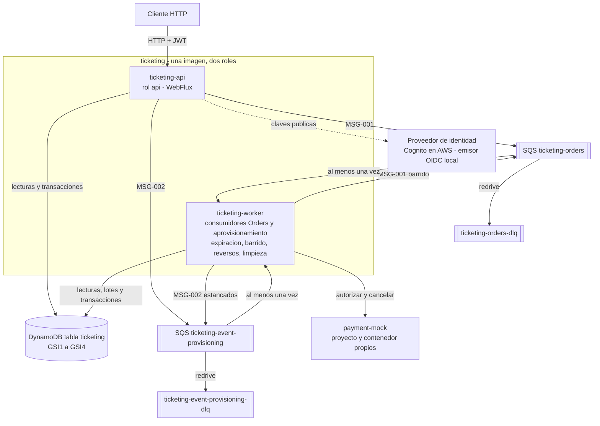

**Español** · [English](README.en.md)

# Ticketing Event Processing Platform

Backend reactivo de venta de entradas (Java 25, Spring Boot 4, WebFlux) sobre DynamoDB y SQS, con un Payment Mock independiente y un entorno local completo en Docker Compose. Reserva entre 1 y 10 Ticket de forma atómica, responde sin esperar el pago y procesa la compra de forma asíncrona sin sobreventa.

| Si quieres… | Ve a |
|---|---|
| Levantar el entorno | [Requisitos](#5-requisitos-previos) → [Configuración](#6-configuración) → [Inicio rápido](#7-inicio-rápido-con-docker-compose) |
| Demostrar los flujos | [Tokens](#9-identidades-y-tokens-locales) → [Payment Mock](#10-control-del-payment-mock) → [API y ejemplos](#11-api-y-ejemplos) → [Colección](#12-colección-de-solicitudes) |
| Evaluar el diseño | [Estado](#2-estado-de-implementación-y-verificación) → [Decisiones](#14-decisiones-arquitectónicas-y-trade-offs) → [Limitaciones](#19-limitaciones-conocidas) → [Producción](#20-cambios-para-producción) |

## 1. Propósito y alcance

**Problema.** En los picos de demanda el sistema anterior vendía el mismo asiento a varias personas, duplicaba compras y agotaba el tiempo de respuesta. **Solución.** Una API reactiva acepta la compra, reserva los Ticket con una única escritura condicional y responde de inmediato con el identificador de la Order; un proceso `worker` cobra mediante el Payment Mock y cierra la Order de forma asíncrona.

Términos del dominio:

| Término | Significado |
|---|---|
| Event | Evento con nombre, lugar, fecha (`startsAt`), capacidad (máximo 50.000) y una definición compacta del inventario. Se aprovisiona de forma asíncrona: `PROVISIONING` → `ENABLED` o `FAILED`. Solo un Event `ENABLED` es visible y vendible |
| Ticket | Asiento individual `<sección>-<fila>-<asiento>` con un único estado: `AVAILABLE`, `RESERVED`, `PENDING_CONFIRMATION`, `SOLD` (final) o `COMPLIMENTARY` (final, no es venta) |
| Order | Compra de 1 a 10 Ticket de un mismo Event, todo o nada. Estados: `CREATED`, `CONFIRMED`, `REJECTED`, `FAILED`, `EXPIRED` |
| Reservation | Retención de los Ticket de una Order durante 10 minutos como máximo (`reservationExpiresAt`) |
| PaymentAttempt | Intento de cobro `<orderId>-1`, idempotente y cancelable ante el Payment Mock |

Fuera de alcance (especificación v5 §3.2): frontend, pantallas de login, reportes, disponibilidad por streaming, proveedor de pagos real y habilitar o modificar un Event ya habilitado.

## 2. Estado de implementación y verificación

Cada afirmación de este repositorio lleva una de estas etiquetas, iguales en ambos idiomas:

| Etiqueta | Significado |
|---|---|
| `Implemented and verified` | Implementado y verificado con evidencia reproducible |
| `Implemented, verification pending` | Implementado; falta la verificación indicada |
| `Designed, not implemented` | Diseñado y aprobado, sin implementación |
| `Optional / differential` | Opcional o de valor diferencial |
| `Out of scope` | Fuera del alcance aprobado |
| `Known limitation` | Limitación conocida y aceptada |
| `NOT_YET_VALIDATED_BY_QA` | Procedimiento documentado sin validación del agente de QA |

| Componente | Estado | Evidencia |
|---|---|---|
| API `API-001` a `API-006` (rol `api`) | `Implemented and verified` | INC-008 e INC-010: pruebas web validadas contra el OpenAPI v2 |
| Consumidores y procesos periódicos (rol `worker`) | `Implemented and verified` | INC-009 e INC-010: pruebas por rol dentro de la JVM |
| Payment Mock `API-101` a `API-111` | `Implemented and verified` | PM-INC-006 y DOC-INC-002: 256 pruebas en verde |
| Entorno Docker Compose (7 servicios y perfil `load`) | `Implemented and verified` | PLAT-INC-007 y DOC-INC-002: arranque limpio y verificadores sin fallos |
| Pruebas unitarias y puerta de cobertura del 90 % | `Implemented and verified` | DOC-INC-002: 770 pruebas, 99,49 % de líneas |
| Pruebas de integración contra emuladores | `Implemented and verified` | INC-010: 129 pruebas `*IT` (no reejecutadas) |
| Cierre del backend (INC-011) | `Implemented, verification pending` | No ejecutado (DOC-ISSUE-005) |
| Colección de demostración `postman/ticketing-demo.*` | `Implemented and verified` | DOC-INC-003: newman 5.3.2, ejecución por defecto y escenarios lentos sin fallos |
| Extremo a extremo de MF-001 a MF-004 sobre Compose | `NOT_YET_VALIDATED_BY_QA` | Solo demostración con la colección (DOC-ISSUE-006) |
| Escenarios de resiliencia de ADR-038 | `NOT_YET_VALIDATED_BY_QA` | Procedimientos en `docs/resilience.md`; comandos ejecutados en DOC-INC-005, sin validación de QA (DOC-ISSUE-006) |
| Prueba de carga (AC-029 a AC-031) | `Designed, not implemented` | El servicio `load-test` termina con error a propósito hasta que QA entregue su arnés (DOC-ISSUE-006) |
| Topología AWS y Terraform (EVAL-011, EVAL-012) | `Designed, not implemented` | Diseño en la arquitectura; sin código de infraestructura |

## 3. Arquitectura en resumen



- **Una imagen, dos roles.** `ticketing-api` atiende `API-001` a `API-006`; `ticketing-worker` consume las colas de Orders y de aprovisionamiento y ejecuta cuatro procesos periódicos: expiración (cada 5 s), barrido de republicación, reversos de pago y limpieza del aprovisionamiento.
- **DynamoDB, una tabla.** Cada Ticket en su propia partición; cuatro índices dispersos (`GSI1` Events por estado, `GSI2` Ticket disponibles con sharding, `GSI3` trabajo de expiración y reversos, `GSI4` Orders pendientes de encolar).
- **SQS Standard** con DLQ para Orders y para aprovisionamiento; entrega al menos una vez con idempotencia de aplicación.
- **Payment Mock** como proyecto y contenedor independientes, configurable por reglas; cancelación obligatoria para reversos.
- **Clean Architecture** con módulos Maven `domain`, `application`, `infrastructure` y `bootstrap`; las dependencias prohibidas no compilan (ADR-034).

Las etiquetas del diagrama están en español, como en la arquitectura aprobada. Contexto, secuencias de cada flujo y topología AWS en [`docs/diagrams.md`](docs/diagrams.md); guía de decisiones en [`docs/architecture.md`](docs/architecture.md).

## 4. Estructura del repositorio

| Carpeta | Contenido |
|---|---|
| `ticketing/` | Backend (Maven multi-módulo: `domain`, `application`, `infrastructure`, `bootstrap`). Un jar, dos roles: `api` y `worker`. |
| `payment-mock/` | Payment Mock independiente (build Maven propio), contrato `payment-mock.openapi.v1.yaml`. |
| `platform/` | `infra-init` (tabla, índices, colas), `local-idp` (emisor OIDC local con las cinco identidades de prueba) y scripts de verificación. |
| `postman/` | Colecciones Postman y sus environments. |
| `docs/` | Documentación de detalle (en español). |
| `docker-compose.yml` | DynamoDB Local, LocalStack (SQS), `infra-init`, `local-idp`, `payment-mock`, `ticketing-api` y `ticketing-worker` (misma imagen, rol por `TICKETING_ROLE`). Perfil `load`: `load-token-generator` y `load-test`. |

## 5. Requisitos previos

| Herramienta | Para qué | Versión verificada |
|---|---|---|
| Docker con Compose v2 | Todo el entorno. Basta para levantarlo: el build de las imágenes compila y ejecuta las pruebas dentro de Docker | Docker 29.8.0, Compose v5.5.1 |
| Git | Clonar el repositorio | 2.39.2 |
| `bash` y `curl` (Git Bash en Windows) | Verificadores de `platform/verify`, ejemplos `curl`, `run-local.sh` | bash 5.2.12, curl 7.87.0 |
| JDK 25 | Build y pruebas fuera de Docker (§13) y modo con JVM locales (§21) | OpenJDK 25.0.4.1 (Zulu 25.36.205) |
| Node.js y newman | Ejecutar la colección desde la línea de comandos (opcional) | Node.js 14.21.3, newman 5.3.2 |
| PowerShell | Alternativa a los bloques `sh` donde la sintaxis difiere | Windows PowerShell 5.1 |

En Windows, clona en una carpeta corta (la ruta versionada más larga tiene 141 caracteres) o activa antes las rutas largas: `git config --global core.longpaths true` (DOC-ISSUE-002). El entorno completo usa en reposo alrededor de 1 GiB de memoria (PLAT-INC-007).

## 6. Configuración

```sh
cp .env.example .env
# Set PAYMENT_MOCK_API_KEY to any value. If a host port is busy, change its *_HOST_PORT
# (e.g. PAYMENT_MOCK_HOST_PORT=18090, TICKETING_API_HOST_PORT, TICKETING_API_MANAGEMENT_HOST_PORT).
```

```powershell
Copy-Item .env.example .env
# Then edit .env: set PAYMENT_MOCK_API_KEY and, if a host port is busy, its *_HOST_PORT value.
```

| Variable | Propósito | Obligatoria |
|---|---|---|
| `PAYMENT_MOCK_API_KEY` | Secreto compartido por `payment-mock` y `ticketing-worker`. Compose no arranca sin ella | Sí |
| `AWS_REGION`, `AWS_ACCESS_KEY_ID`, `AWS_SECRET_ACCESS_KEY` | Credenciales **ficticias**, válidas solo contra los emuladores | Sí (vienen en `.env.example`) |
| `*_HOST_PORT` | Puertos del host, siempre en `127.0.0.1` (por defecto 8080, 8081, 8090, 9000, 8000, 4566) | No |
| `LOCAL_IDP_*`, `TICKETING_WORKER_ID`, `LOAD_TOKEN_*` | Emisor local, identificador del `worker` y perfil de carga | No |

`.env` no se versiona; `.env.example` solo contiene valores ficticios. Tabla completa, con las variables que Compose pasa a la aplicación, en [`docs/operations.md`](docs/operations.md#2-variables-de-env).

El backend lee su configuración de variables de entorno (`TICKETING_ROLE=api|worker`, `TICKETING_DYNAMODB_TABLE`, `TICKETING_SQS_*_QUEUE_URL`, `TICKETING_SECURITY_*`, `TICKETING_PAYMENT_*`, …). `run-local.sh` muestra el conjunto local completo. Las credenciales AWS se leen con la cadena estándar del SDK; los valores de `.env.example` son ficticios y solo válidos contra los emuladores locales.

## 7. Inicio rápido con Docker Compose

Desde la raíz del repositorio:

```sh
docker compose up -d --wait     # builds the ticketing image (runs the unit test suite) and starts all services
docker compose ps -a            # 6 services healthy and infra-init "Exited (0)"
docker compose logs -f ticketing-api ticketing-worker   # structured JSON logs (Ctrl+C to leave)
```

El primer `up` construye las imágenes, con sus pruebas, en unos 2 minutos (PLAT-INC-007); con las imágenes ya construidas tarda unos 25 segundos (24,8 s medidos en DOC-INC-002). Orden de arranque: emuladores, emisor local y Payment Mock; después `infra-init` crea la tabla y las colas; por último `ticketing-api` y `ticketing-worker`, de la misma imagen. El `api` se publica en `127.0.0.1:8080` (API) y `127.0.0.1:8081` (gestión); el `worker` no publica puertos.

Parada y limpieza:

```sh
docker compose stop             # graceful stop; emulator data is lost on the next start
docker compose down             # removes containers and network (data is ephemeral)
docker compose down -v          # also removes the load profile volume (load-tokens)
```

Los emuladores no guardan datos en disco: tras `stop` y un nuevo `up -d --wait`, `infra-init` recrea la tabla y las colas vacías (verificado: parada en 7,2 s y nuevo arranque en 28 s). `down -v` solo afecta a este proyecto. Detalle de cada comando en [`docs/operations.md`](docs/operations.md#4-ciclo-de-vida).

## 8. Verificación del entorno

```sh
bash platform/verify/environment.sh   # exit code = number of failed checks
curl -s http://localhost:8080/readyz  # {"status":"UP"}
curl -s -o /dev/null -w '%{http_code}\n' http://localhost:8090/health   # 200; use your PAYMENT_MOCK_HOST_PORT
MSYS_NO_PATHCONV=1 docker compose run --rm --no-deps -v ./platform/verify:/verify:ro --entrypoint sh infra-init /verify/resources.sh
```

| Comprobación | Resultado en DOC-INC-002 |
|---|---|
| `environment.sh`: topología, salud, puertos en `127.0.0.1`, endurecimiento, imágenes fijadas, ausencia de secretos | 65 correctas, 0 fallos |
| `resources.sh`: tabla `ticketing`, `GSI1` a `GSI4`, TTL y las cuatro colas con su redrive | 38 correctas, 0 fallos |
| Salud: `:8080/readyz`, `:8080/livez`, `:8081/actuator/health`, `:8090/health`, discovery y JWKS de `:9000` | 200 |
| `/actuator/**` en el puerto público 8080 | 401 (gestión solo en el puerto 8081) |

`MSYS_NO_PATHCONV=1` solo hace falta en Git Bash. Métricas en el puerto de gestión: `GET :8081/actuator/prometheus`. Verificador de identidades y otros detalles en [`docs/operations.md`](docs/operations.md#5-verificadores).

## 9. Identidades y tokens locales

`local-idp` emite tokens RS256 con la forma de Cognito (`sub`, `cognito:groups`, `token_use=access`, `client_id`, `iss`, `exp`). Es solo local y no pide credenciales.

| Identidad | Grupos | Uso en la demostración |
|---|---|---|
| `admin` | `ADMIN` | Crear Events y consultar su aprovisionamiento |
| `customer-a`, `customer-b` | `CUSTOMER` | Comprar y comprobar que una Order ajena no se revela |
| `admin-customer` | `ADMIN`, `CUSTOMER` | Un `ADMIN` que también puede comprar |
| `no-groups` | Ninguno | Recibe 403 en toda operación protegida |
| `sub=<id>&groups=CUSTOMER` | `CUSTOMER` | Sujetos arbitrarios: cada uno tiene su propio límite de compras |

```sh
# Access token for one of the identities: admin, customer-a, customer-b, admin-customer, no-groups
curl -s -X POST http://localhost:9000/token -d identity=admin
# Keep tokens in shell variables instead of printing them
ADMIN_TOKEN=$(curl -s -X POST http://localhost:9000/token -d identity=admin | sed -E 's/.*"access_token" *: *"([^"]+)".*/\1/')
CUSTOMER_TOKEN=$(curl -s -X POST http://localhost:9000/token -d identity=customer-a | sed -E 's/.*"access_token" *: *"([^"]+)".*/\1/')
# Arbitrary CUSTOMER subject
BUYER_TOKEN=$(curl -s -X POST http://localhost:9000/token -d 'sub=demo-buyer-1&groups=CUSTOMER' | sed -E 's/.*"access_token" *: *"([^"]+)".*/\1/')
```

```powershell
$ADMIN_TOKEN = (Invoke-RestMethod -Method Post -Uri http://localhost:9000/token -Body @{ identity = 'admin' }).access_token
$CUSTOMER_TOKEN = (Invoke-RestMethod -Method Post -Uri http://localhost:9000/token -Body @{ identity = 'customer-a' }).access_token
```

Los tokens duran 3.600 s y su `iss` es siempre `http://local-idp:9000`, también cuando se piden desde el host. Reiniciar `local-idp` cambia la clave de firma e invalida los tokens anteriores. En PowerShell 5.1, `curl` es un alias de `Invoke-WebRequest`: usa `curl.exe` o los cmdlets.

## 10. Control del Payment Mock

El resultado del pago se elige solo con reglas del Payment Mock, nunca con un campo de la compra (AV-004). Antes de un escenario de rechazo, fallo o latencia: reinicia el mock, crea la regla, ejecuta la compra e inspecciona el resultado. El estado del mock vive en memoria y se pierde al reiniciarlo.

```sh
PAYMENT_MOCK_API_KEY=$(grep '^PAYMENT_MOCK_API_KEY=' .env | cut -d= -f2- | tr -d '\r')
MOCK_URL=http://localhost:$(grep '^PAYMENT_MOCK_HOST_PORT=' .env | cut -d= -f2 | tr -d '\r')
curl -s -o /dev/null -w '%{http_code}\n' -X POST "$MOCK_URL/control/reset" -H "X-Api-Key: $PAYMENT_MOCK_API_KEY"   # 204
curl -s -X PUT "$MOCK_URL/control/defaults" -H "X-Api-Key: $PAYMENT_MOCK_API_KEY" \
  -H 'Content-Type: application/json' -d '{"defaultOutcome":"APPROVED","declinePercentage":0}'
# Decline every payment of one buyer: customerRef is the JWT subject of the buyer
curl -s -X POST "$MOCK_URL/control/rules" -H "X-Api-Key: $PAYMENT_MOCK_API_KEY" \
  -H 'Content-Type: application/json' -d '{"match":{"customerRef":"demo-buyer-1"},"behaviour":{"type":"DECLINE"}}'
curl -s "$MOCK_URL/control/rules" -H "X-Api-Key: $PAYMENT_MOCK_API_KEY"
```

```powershell
$PAYMENT_MOCK_API_KEY = ((Get-Content .env | Select-String '^PAYMENT_MOCK_API_KEY=').Line -split '=', 2)[1]
$MOCK_URL = 'http://localhost:' + ((Get-Content .env | Select-String '^PAYMENT_MOCK_HOST_PORT=').Line -split '=', 2)[1]
Invoke-WebRequest -UseBasicParsing -Method Post -Uri "$MOCK_URL/control/reset" -Headers @{ 'X-Api-Key' = $PAYMENT_MOCK_API_KEY }
```

| Operación | Uso |
|---|---|
| `API-110` `POST /control/reset` | Borra reglas, defaults, autorizaciones y cancelaciones (204) |
| `API-107` `PUT /control/defaults` | Resultado por defecto y porcentaje determinista de rechazo |
| `API-104` `POST /control/rules`, `API-103` `GET /control/rules` | Crear y listar reglas. Un único criterio por regla, con precedencia `orderId`, `ticketId`, `customerRef`, `eventId` |
| `API-106` `DELETE /control/rules/{ruleId}`, `API-105` `DELETE /control/rules` | Borrar una regla o todas (204) |
| `API-108` `GET /control/authorizations/{paymentAttemptId}` | Autorizaciones recibidas para `<orderId>-1` (404 si ninguna) |
| `API-109` `GET /control/cancellations/{paymentAttemptId}` | Cancelaciones (reversos) recibidas (404 si ninguna) |
| `API-111` `GET /health` | Salud, sin API key |
| `API-101` `POST /payments`, `API-102` `POST /payments/{paymentAttemptId}/cancellation` | Las usa el `worker`; en la demostración no se invocan a mano |

| Comportamiento de regla | Efecto previsto en la Order (ADR-030) |
|---|---|
| `APPROVE` / `DECLINE` | `CONFIRMED` / `REJECTED` con `PAYMENT_DECLINED` |
| `DEFINITIVE_ERROR` | El mock responde 422; la Order termina `FAILED` con `PROCESSING_FAILED`, sin reverso |
| `TRANSIENT_THEN_OUTCOME` | N respuestas 503 y después `finalOutcome`; el `worker` reintenta con el mismo `paymentAttemptId` |
| `LATENCY` | Retraso de `addedLatencyMs` (hasta 60.000 ms); más de 3.000 ms supera el timeout del `worker` |

Todas las operaciones de control exigen la cabecera `X-Api-Key` (401 sin ella). Contrato: [`payment-mock.openapi.v1.yaml`](ticketing/infrastructure/src/test/resources/contracts/payment-mock.openapi.v1.yaml).

## 11. API y ejemplos

| ID | Método y ruta | Rol | Respuestas principales |
|---|---|---|---|
| `API-001` | `POST /api/v1/events` (`Idempotency-Key`) | `ADMIN` | 202 `PROVISIONING` con `Location`; 200 repetición; 400; 422 `IDEMPOTENCY_KEY_REUSED` |
| `API-002` | `GET /api/v1/events` | `ADMIN` o `CUSTOMER` | 200 Events `ENABLED` futuros con `soldOut`, paginados por cursor |
| `API-003` | `GET /api/v1/events/{eventId}/availability` | `ADMIN` o `CUSTOMER` | 200 `availableCount` y página de Ticket `AVAILABLE`; 400 cursor o sección inválidos; 404 |
| `API-004` | `POST /api/v1/orders` (`Idempotency-Key`) | `CUSTOMER` | 201 `CREATED` sin esperar el pago; 200 repetición; 409 `TICKETS_UNAVAILABLE`, `ACTIVE_ORDER_EXISTS`, `EVENT_NOT_ON_SALE`; 422; 429; 503 |
| `API-005` | `GET /api/v1/orders/{orderId}` | `CUSTOMER` propietario | 200 estado y causa funcional; el mismo 404 para una Order ajena, inexistente o malformada |
| `API-006` | `GET /api/v1/events/{eventId}/provisioning` | `ADMIN` | 200 `PROVISIONING`, `ENABLED` o `FAILED` con progreso |

Contrato completo: [`ticketing.openapi.v2.yaml`](ticketing/infrastructure/src/test/resources/contracts/ticketing.openapi.v2.yaml), copia verificada por SHA-256 del contrato aprobado. Los errores son Problem Details (`application/problem+json`) con `code` estable y `traceId`.

Recorrido de MF-001 a MF-004 con `curl`, desde Git Bash, Linux o macOS (en PowerShell, usa la colección del §12). El bloque crea su propio Event y su propio sujeto `CUSTOMER`:

```sh
API=http://localhost:8080/api/v1
token() { curl -s -X POST http://localhost:9000/token -d "$1" | sed -E 's/.*"access_token" *: *"([^"]+)".*/\1/'; }
ADMIN_TOKEN=$(token identity=admin)
CUSTOMER_TOKEN=$(token identity=customer-b)
BUYER_TOKEN=$(token "sub=demo-buyer-$(date +%s)&groups=CUSTOMER")
STARTS_AT=$(date -u -d '+30 days' +%Y-%m-%dT%H:%M:%SZ)   # GNU date; on macOS: date -u -v+30d +%Y-%m-%dT%H:%M:%SZ

# MF-001: create an Event (202, PROVISIONING) and poll its provisioning status until ENABLED
EVENT_ID=$(curl -s -X POST "$API/events" -H "Authorization: Bearer $ADMIN_TOKEN" -H 'Content-Type: application/json' \
  -H "Idempotency-Key: evt-readme-$(date +%s)" \
  -d "{\"name\":\"Concert\",\"venue\":\"Arena\",\"startsAt\":\"$STARTS_AT\",\"capacity\":12,
       \"inventory\":{\"sections\":[{\"code\":\"A\",\"rows\":[{\"label\":\"1\",\"seats\":10}]},{\"code\":\"VIP\",\"rows\":[{\"label\":\"1\",\"seats\":2}]}],
       \"complimentary\":[{\"section\":\"VIP\",\"row\":\"1\",\"fromSeat\":1,\"toSeat\":2}]}}" \
  | sed -E 's/.*"eventId" *: *"([^"]+)".*/\1/')
for i in $(seq 1 30); do
  STATUS=$(curl -s "$API/events/$EVENT_ID/provisioning" -H "Authorization: Bearer $ADMIN_TOKEN" | sed -E 's/.*"provisioningStatus" *: *"([^"]+)".*/\1/')
  [ "$STATUS" != PROVISIONING ] && break; sleep 1
done; echo "provisioning: $STATUS"   # ENABLED

# MF-002: list future Events (soldOut flag) and read one availability page of section A
curl -s "$API/events?limit=20" -H "Authorization: Bearer $BUYER_TOKEN"; echo
curl -s "$API/events/$EVENT_ID/availability?section=A&pageSize=5" -H "Authorization: Bearer $BUYER_TOKEN"; echo

# MF-003: start a purchase (201 CREATED without waiting for the payment) and poll the Order
ORDER_ID=$(curl -s -X POST "$API/orders" -H "Authorization: Bearer $BUYER_TOKEN" -H 'Content-Type: application/json' \
  -H "Idempotency-Key: ord-readme-$(date +%s)" -d "{\"eventId\":\"$EVENT_ID\",\"ticketIds\":[\"A-1-1\",\"A-1-2\"]}" \
  | sed -E 's/.*"orderId" *: *"([^"]+)".*/\1/')
for i in $(seq 1 30); do
  STATUS=$(curl -s "$API/orders/$ORDER_ID" -H "Authorization: Bearer $BUYER_TOKEN" | sed -E 's/.*"status" *: *"([^"]+)".*/\1/')
  case "$STATUS" in CONFIRMED|REJECTED|FAILED|EXPIRED) break ;; esac; sleep 1
done; echo "order: $STATUS"   # CONFIRMED with the default Payment Mock outcome

# MF-004: the owner reads the Order; another customer gets the same 404 as for a missing Order
curl -s "$API/orders/$ORDER_ID" -H "Authorization: Bearer $BUYER_TOKEN"; echo
curl -s -o /dev/null -w '%{http_code}\n' "$API/orders/$ORDER_ID" -H "Authorization: Bearer $CUSTOMER_TOKEN"   # 404
```

Dos ideas que el recorrido hace visibles: crear un Event y comprar son **asíncronos** (202 y 201 inmediatos, estado final por sondeo), y la disponibilidad es **informativa**: no reserva nada y la compra vuelve a validar cada Ticket. Verificado en DOC-INC-003: `ENABLED`, `CONFIRMED` y 404 para el otro cliente.

## 12. Colección de solicitudes

**Colección principal de demostración (`DEL-004`):** `postman/ticketing-demo.postman_collection.json` con el environment `postman/ticketing-demo.postman_environment.json`. Cubre MF-001 a MF-005, rechazo y fallos deterministas configurando antes el Payment Mock, idempotencia, Order activa, seguridad, 413 y 429.

1. Importa ambos archivos en Postman y selecciona el environment **Ticketing demo (local)**.
2. Escribe en `paymentMockApiKey` el valor de `PAYMENT_MOCK_API_KEY` de tu `.env` (en el archivo versionado está vacío) y ajusta `paymentMockUrl` si cambiaste el puerto.
3. Ejecuta con el Collection Runner las carpetas **00 a 08 y 99**, en orden (unos 12 s). La carpeta **09** contiene escenarios lentos (reentrega transitoria, reverso de MF-005 y Event pasado; unos 3 minutos en total) y se ejecuta aparte.

Desde la línea de comandos, con newman 5.3.2:

```sh
PAYMENT_MOCK_API_KEY=$(grep '^PAYMENT_MOCK_API_KEY=' .env | cut -d= -f2- | tr -d '\r')
newman run postman/ticketing-demo.postman_collection.json -e postman/ticketing-demo.postman_environment.json \
  --env-var paymentMockUrl=http://localhost:8090 --env-var "paymentMockApiKey=$PAYMENT_MOCK_API_KEY" \
  --folder "00 Entorno y salud" --folder "01 Control del Payment Mock" --folder "02 Aprovisionamiento de Event (MF-001)" \
  --folder "03 Catálogo y disponibilidad (MF-002)" --folder "04 Compra confirmada (MF-003, MF-004)" \
  --folder "05 Pago rechazado (AC-020)" --folder "06 Comportamientos de fallo" --folder "07 Idempotencia y Order activa" \
  --folder "08 Seguridad y propiedad" --folder "99 Limpieza"
```

| Ejecución verificada | Solicitudes ejecutadas | Aserciones | Fallos |
|---|---|---|---|
| Carpetas por defecto, primera ejecución (DOC-INC-003) | 95 | 243 | 0 |
| Carpetas por defecto, segunda ejecución seguida | 95 | 243 | 0 |
| Carpetas por defecto tras `down -v` y `up -d --wait` (DOC-INC-006) | 96 | 244 | 0 |
| Carpetas 00 a 02, 09 y 99 (escenarios lentos, 3 min 8 s; DOC-INC-003) | 208 | 226 | 0 |

Las solicitudes ejecutadas incluyen las repeticiones de sondeo, por eso los conteos varían ligeramente entre ejecuciones. Cada ejecución crea su propio Event, sus sujetos y sus reglas, así que no depende de ejecuciones anteriores; la carpeta 99 borra los tokens de la colección. La colección demuestra los flujos y no sustituye las pruebas automatizadas ni la validación de QA. Detalle carpeta por carpeta, variables y lo que no demuestra: [`docs/collection-guide.md`](docs/collection-guide.md).

**Colección previa:** `postman/ticketing.postman_collection.json` y `postman/ticketing-local.postman_environment.json`, creadas por el autor antes de esta documentación, se conservan sin cambios. Cubren el flujo feliz y varios errores; sus diferencias con la principal están en [`docs/collection-guide.md`](docs/collection-guide.md#9-colección-previa).

## 13. Build y pruebas

```sh
cd ticketing
./mvnw verify                  # unit, architecture, blocking detector and 90 % coverage gate (no Docker)
./mvnw verify -Pintegration    # adds the integration tests against DynamoDB Local and LocalStack (Docker)

cd ../payment-mock
./mvnw verify
```

`./mvnw` necesita JDK 25: define `JAVA_HOME` para la invocación si tu JDK por defecto es otro. En PowerShell usa `.\mvnw.cmd verify`.

| Comando | Directorio | Resultado | Fuente |
|---|---|---|---|
| `./mvnw verify` | `ticketing/` | 770 pruebas (dominio 99, application 277, infrastructure 369, bootstrap 24, puerta 1), 0 fallos; cobertura agregada de líneas 99,49 % (5.505 de 5.533) con la puerta del 90 % en verde; 1 min 47 s | DOC-INC-002, revisión `90f8ed2` |
| `./mvnw verify -Pintegration` | `ticketing/` | Además 129 pruebas `*IT` contra DynamoDB Local y LocalStack, 0 fallos; unos 4 min 14 s | INC-010, revisión `69a2c23` (no reejecutado por decisión humana) |
| `./mvnw verify` | `payment-mock/` | 256 pruebas, 0 fallos; 35 s | DOC-INC-002, revisión `90f8ed2` |

La cobertura se mide sobre `domain`, `application` e `infrastructure` de `ticketing`, solo con pruebas sin contenedores (ADR-038); `payment-mock` mantiene sus pruebas sin puerta. La colección de solicitudes demuestra los flujos; no sustituye estas pruebas ni la validación de QA.

## 14. Decisiones arquitectónicas y trade-offs

| Problema | Decisión | Alternativa descartada | Consecuencia aceptada | ADR |
|---|---|---|---|---|
| Partición caliente con miles de compras sobre un Event de 50.000 Ticket | Una tabla DynamoDB con cada Ticket en su propia partición | Ticket en la colección del Event | Disponibilidad leída de un índice, eventual y paginada | ADR-022 |
| Reservar varios Ticket todo o nada y sin sobreventa | Una transacción condicional multi-partición (hasta 14 items) | Bloqueo optimista por versión; escrituras por Ticket con compensación | Conflictos bajo contención, reintentados de forma acotada | ADR-023, ADR-003 |
| Order y Ticket coherentes y un único desenlace | Una transacción por transición con la Order como guardián (`CREATED`) | Saga con estados intermedios | Tres transacciones por compra confirmada | ADR-025 |
| Persistir en DynamoDB y encolar en SQS sin transacción común | Publicación directa con presupuesto de 2 s, compensación a `FAILED` y barrido a los 30 s | Outbox con relay como mecanismo principal | Mensajes duplicados ocasionales, tolerados | ADR-026 |
| Entrega al menos una vez sin cobros ni ventas duplicados | Idempotencia por operación (`Idempotency-Key`, `orderId`, `paymentAttemptId`), lease de 45 s, 5 recepciones y DLQ | Tabla de mensajes procesados; cola FIFO | Un duplicado concurrente consume una recepción | ADR-027, ADR-029 |
| Crear Events de 50.000 Ticket sin bloquear la API | Aprovisionamiento asíncrono por lotes con lease, verificación y habilitación (202) | Creación síncrona | Creación observable en dos pasos | ADR-024 |
| Pago que llega cuando vence la Reservation | Gana la primera transición final; confirmar exige `expiresAt` futuro; reverso de pagos no aplicados | Confirmar aprobaciones tardías | Caso "cobrado y reversado" | ADR-008, ADR-025, ADR-030 |
| Liberar Reservation vencidas en 15 s | Procesos periódicos aislados (expiración cada 5 s) en cada `worker` | TTL de DynamoDB; planificador único | Liberación hasta 15 s tarde | ADR-028 |
| Dependencias degradadas | Circuit breakers del Payment Mock (pausa el consumo) y de SQS (503 antes de reservar) | Retry genérico en casos de uso; circuito sobre DynamoDB | Estado del circuito por instancia | ADR-035, ADR-039 |
| Disponibilidad rápida sin contador compartido | Índice de disponibles con sharding, cursor y recuento cacheado 1 s | Contador en el Event | Recuento con hasta 1 s de antigüedad | ADR-040 |
| Seguridad y abuso | Resource Server, roles y propiedad, una Order activa por cliente y Event, límites de cuerpo y tasa | Validación solo en el borde | Limitador en memoria por instancia | ADR-032, ADR-033 |
| Auditoría sin transiciones sin evidencia | Registro de solo inserción en la misma transacción | Captura de cambios como mecanismo principal | Auditoría en la tabla operativa | ADR-031 |
| Separación de capas y mock desacoplado | Multi-módulo con dependencias del compilador; `payment-mock` independiente | Módulo único; DTOs compartidos | Dos builds | ADR-034, ADR-030 |
| Entorno local fiel al objetivo | Compose con `infra-init` y la misma imagen en dos roles | Contenedor único que crea recursos | Siete contenedores | ADR-036 |

Cada decisión, con su problema, alternativa y consecuencia, en [`docs/architecture.md`](docs/architecture.md#2-decisiones). Los ADR viven en `SPEC_REPO`: [registro de decisiones](https://github.com/jtorres1990/PruebaeTecnicaNequi/blob/main/architecture/adr/ticketing.adr-registry.v1.md).

## 15. Concurrencia, atomicidad e idempotencia

- **Sin sobreventa.** Cada Ticket se reserva con la condición "existe, pertenece al Event y está `AVAILABLE`" dentro de una única transacción con la Order, la idempotencia, la auditoría y el bloqueo de Order activa. Si un solo Ticket no cumple, no cambia nada y no hay Order ni Order ID (ADR-023).
- **Un único desenlace.** Toda transición final exige que la Order siga `CREATED`: pago, rechazo, fallo y expiración compiten y gana uno; confirmar exige además que la Reservation no haya vencido (ADR-025, ADR-008).
- **Una Order activa por cliente y Event**, con un item de bloqueo creado en la misma transacción: una segunda compra recibe 409 `ACTIVE_ORDER_EXISTS` (ADR-032).
- **Idempotencia** por operación: `Idempotency-Key` del cliente en compra y creación de Event (repetición 200 con `Idempotency-Replayed: true`, otro contenido 422), `orderId` y `eventId` para los mensajes, y `paymentAttemptId = <orderId>-1` ante el proveedor. Un rechazo no persiste nada y repetirlo se evalúa de nuevo (ADR-027).
- **Pagos no aplicados.** Si una Order se cierra sin confirmar con un pago aprobado o desconocido, la misma transacción la marca para reverso y un proceso cancela el intento (MF-005, ADR-025, ADR-030).

| Evidencia | Estado |
|---|---|
| 8 compras simultáneas del mismo Ticket con un solo ganador; conjuntos solapados sin Ticket en dos Orders (AC-007); 5 compras simultáneas del mismo cliente con una Order (AC-044); carrera de misma clave (`DynamoDbMechanismIT`, INC-005) | `Implemented and verified` |
| Entregas duplicadas con una sola autorización (AC-023), fallo con reverso exactamente una vez y expiración con reloj inyectado (`RoleComponentIT`, INC-010) | `Implemented and verified` |
| Idempotencia, Order activa, reintento con el mismo intento y reverso sobre Compose (colección 04, 06, 07 y 09) | `Implemented and verified` |
| Sobreventa bajo carga con más de 1.000 usuarios (AC-029) | `NOT_YET_VALIDATED_BY_QA` |

Detalle de transiciones y frentes de idempotencia en [`docs/architecture.md`](docs/architecture.md#3-concurrencia-atomicidad-e-idempotencia).

## 16. Seguridad y secretos

| Control | Implementación | Estado |
|---|---|---|
| Autenticación | Resource Server: firma RS256, emisor, expiración (60 s de tolerancia), `token_use = access` y `client_id`; sin sesión | `Implemented and verified` |
| Autorización | `ADMIN` crea Events y consulta su aprovisionamiento; `CUSTOMER` compra y consulta sus Orders; ambos listan y consultan disponibilidad. 401 sin token, 403 sin rol | `Implemented and verified` |
| Propiedad | El dueño de la Order es el `sub` del JWT; la compra no acepta identificadores de usuario. Una Order ajena, inexistente o malformada responde el mismo 404 | `Implemented and verified` |
| Abuso | Idempotencia obligatoria, 1 a 10 Ticket, una Order activa por cliente y Event, cuerpo máximo de 256 KB (413), 10 compras por 10 s y sujeto (429 con `Retry-After`) | `Implemented and verified` |
| Secretos | La API key del Payment Mock solo está en `.env`, que no se versiona; `.env.example` y las credenciales AWS son ficticias; ni la clave ni JWT aparecen en imágenes, configuración resuelta ni logs (PLAT-INC-007); los logs nunca incluyen tokens ni cabeceras de autorización | `Implemented and verified` |
| Contenedores | Usuario sin privilegios, raíz de solo lectura, `cap_drop: ALL`, `no-new-privileges`, puertos solo en `127.0.0.1`, imágenes fijadas por tag y digest | `Implemented and verified` |
| Gestión | Métricas solo en el puerto de gestión 8081; `/actuator/**` en el puerto público responde 401 | `Implemented and verified` |
| AWS | Cognito, roles de tarea sin claves estáticas, gestor de secretos, WAF con tasa y control de bots, subredes privadas | `Designed, not implemented` |

`local-idp` emite tokens sin credenciales por diseño y solo existe en el perfil local (ADR-033). Detalle en [`docs/architecture.md`](docs/architecture.md#4-seguridad).

## 17. Observabilidad y operación

| Señal | Dónde | Estado |
|---|---|---|
| Logs JSON (ECS) con `event`, `orderId`, `eventId`, `correlationId`, sin tokens | `docker compose logs ticketing-api ticketing-worker` | `Implemented and verified` |
| Métricas de negocio y técnicas: reservas, Orders finales por causa, demora de expiración, reversos, aprovisionamiento, estado de los circuitos, DynamoDB, SQS, limitador | `GET :8081/actuator/prometheus` (el `worker` solo desde la red de Compose) | `Implemented and verified` |
| Trazas propagadas de HTTP a los mensajes; el `traceId` de los errores es el de la traza | `traceparent`; exportación OTLP desactivada por defecto | `Implemented and verified` |
| Apagado ordenado: el `api` termina las solicitudes en curso y el `worker` los mensajes y ciclos en vuelo (35 s por fase) | `docker compose stop` | `Implemented and verified` |
| Profundidad y antigüedad de colas y DLQ, "reversos pendientes" como métrica directa, "Orders expiradas sin encolar" | Métricas del servicio SQS o derivadas de contadores (DOC-ISSUE-004) | `Designed, not implemented` |
| Catálogo de alarmas, panel y retención de logs en CloudWatch | ADR-037 | `Designed, not implemented` |

Catálogo de métricas, salud y verificadores en [`docs/operations.md`](docs/operations.md#6-salud-métricas-logs-y-trazas); implementado frente a diseñado en [`docs/architecture.md`](docs/architecture.md#5-observabilidad).

## 18. Resiliencia

| Mecanismo | Qué hace | ADR | Estado |
|---|---|---|---|
| Circuit breaker del Payment Mock | Abre con el 50 % de fallos o de llamadas lentas en 20; pausa el consumo de Orders y los reversos sin gastar recepciones; la expiración sigue | ADR-035 | `Implemented and verified` |
| Circuit breaker de publicación en SQS | Con el circuito abierto, la compra responde 503 con `Retry-After` antes de reservar | ADR-035 | `Implemented and verified` |
| Reentregas con backoff por visibilidad, 5 recepciones y DLQ | Los fallos transitorios se reintentan sin duplicar efectos; en la última recepción la Order se cierra `FAILED` | ADR-029 | `Implemented and verified` |
| Lease del PaymentAttempt (45 s) | Si un `worker` cae a mitad de un pago, otro reanuda el mismo intento al vencer el lease | ADR-027, ADR-029 | `Implemented and verified` |
| Barrido de republicación, expiración cada 5 s, detección de estancados, reversos | Nada queda colgado: Orders sin mensaje, Reservation vencidas, aprovisionamientos sin progreso y pagos sin compra | ADR-024 a ADR-028 | `Implemented and verified` |

Evidencia de los mecanismos: pruebas del backend con tiempo virtual y por rol (INC-006, INC-007, INC-009, INC-010) y la colección (carpetas 06 y 09).

Escenarios de ADR-038 sobre Docker Compose, documentados paso a paso en [`docs/resilience.md`](docs/resilience.md):

| Escenario | Qué se espera | Observado al verificar los comandos (DOC-INC-005) | Estado |
|---|---|---|---|
| 1. `docker compose kill ticketing-worker` a mitad de un pago | Al volver, se reanuda el mismo PaymentAttempt; un único intento en el mock | `CONFIRMED` unos 62 s después; 2 invocaciones del mismo `paymentAttemptId` y un solo resultado | `NOT_YET_VALIDATED_BY_QA` |
| 2. `docker compose stop payment-mock` | Circuito abierto, consumo pausado; al volver, se reanuda | Circuito `OPEN` en unos 10 s; Orders en `CREATED`; `CONFIRMED` tras reiniciar el mock | `NOT_YET_VALIDATED_BY_QA` |
| 3. `docker compose pause localstack` | 503 con `Retry-After` sin modificar el inventario; al recuperar, las compras vuelven a crear Orders | Primeras compras `FAILED` (`PROCESSING_UNAVAILABLE`), después 503 con `Retry-After: 10`; inventario intacto; 201 tras `unpause` | `NOT_YET_VALIDATED_BY_QA` |

Ejecutar los comandos no equivale a la validación de QA, que sigue pendiente (DOC-ISSUE-006).

## 19. Limitaciones conocidas

| Limitación | Estado | Fuente |
|---|---|---|
| Los objetivos de carga (200 solicitudes/s, p95 de 500 ms y 1 s) son objetivos de prueba, no capacidad productiva; además la prueba de carga no se ha ejecutado | `Known limitation` | ADR-038, DOC-ISSUE-006 |
| Disponibilidad eventual: recuento con hasta 1 s de antigüedad, orden no global por sección; no garantiza la compra | `Known limitation` | ADR-040 |
| Liberación de Ticket hasta 15 s después de `expiresAt` | `Known limitation` | AV-003 |
| Una Order en cuarentena retiene sus Ticket y el bloqueo hasta revisión manual; un reverso agotado deja un cobro pendiente de revisión | `Known limitation` | RISK-018, RISK-020 |
| Doble fallo en la última recepción: la Order termina `EXPIRED` en lugar de `FAILED` | `Known limitation` | RISK-014 |
| Circuit breakers y limitador de tasa por instancia y en memoria; el acaparamiento con varias cuentas solo se mitiga en el borde (diseño) | `Known limitation` | RISK-017, ADR-032 |
| Auditoría en la tabla operativa, inmutable solo por convención | `Known limitation` | RISK-015 |
| Riesgo residual en el aprovisionamiento si un `worker` pausado supera su lease | `Known limitation` | RISK-016 |
| La idempotencia de creación de Events dura 24 h | `Known limitation` | RISK-022 |
| Sin importe en el pago (la especificación no define precios) | `Out of scope` | Arquitectura v2 §17 |
| Identidad local simulada: los claims frente a un user pool real de Cognito no se han verificado; LocalStack fijado a 4.14.0 | `Known limitation` | RISK-013, RISK-021 |
| El contrato del mock acota `customerRef` a 128 caracteres y `ticketing` no acota el `sub` (en local no se alcanza) | `Known limitation` | DOC-ISSUE-003 |
| El esquema `OutcomeRule` del contrato del mock no lo satisface un validador estricto; el mock aplica una tolerancia aprobada | `Known limitation` | DOC-ISSUE-001 |
| El entorno local no tiene particionado ni throttling reales: el beneficio del particionado por Ticket solo se observa en AWS | `Known limitation` | RISK-007, RISK-008 |

Lista completa con su contexto en [`docs/architecture.md`](docs/architecture.md#7-limitaciones-conocidas).

## 20. Cambios para producción

La topología AWS está **diseñada y aprobada, no implementada**: no hay Terraform ni otro código de infraestructura en este repositorio (EVAL-011, valor diferencial pendiente). Diseño: ECS sobre Fargate con servicios `api` y `worker` de la misma imagen, ALB con TLS y WAF, VPC por entorno con subredes privadas y endpoints privados, roles de tarea con mínimo privilegio, gestor de secretos, escalado del `worker` por mensajes pendientes y antigüedad, CloudWatch con catálogo de alarmas y una cuenta por entorno (ADR-037).

| Tema | Cambio | Estado |
|---|---|---|
| Infraestructura | Materializar la topología AWS como código, equivalente a `infra-init` | `Designed, not implemented` |
| Publicación | Outbox con relay por captura de cambios si la ventana residual no es aceptable | `Designed, not implemented` |
| Capacidad | Warm throughput antes de aperturas de venta; prueba de carga en AWS | `Designed, not implemented` |
| Pagos | Proveedor real con idempotencia y cancelación equivalentes; conciliación periódica | `Designed, not implemented` |
| Auditoría | Captura de cambios a almacenamiento con bloqueo de objetos | `Designed, not implemented` |
| Abuso | Limitación distribuida en el borde y control de bots | `Designed, not implemented` |
| Resiliencia | Estado de circuito compartido si hace falta; estrategia multi-región | `Designed, not implemented` |
| Operación | Despliegues progresivos, objetivos de nivel de servicio, procedimientos para DLQ, cuarentena y reversos agotados | `Designed, not implemented` |

Red, IAM, escalado, coste, aislamiento y gobernanza en [`docs/architecture.md`](docs/architecture.md#6-topología-aws-diseño); diagrama en [`docs/diagrams.md`](docs/diagrams.md#14-topología-objetivo-en-aws-designed-not-implemented).

## 21. Modo desarrollo con JVM locales

`run-local.sh` levanta solo las dependencias de Compose y ejecuta los roles `api` y `worker` como procesos Java locales. No lo uses mientras la opción de Compose completa esté en marcha: ambos usan los puertos 8080 y 8081. Detén antes los servicios de la aplicación y define `JAVA_HOME` con un JDK 25.

```sh
docker compose stop ticketing-api ticketing-worker   # only if the full Compose option is running
./run-local.sh start   # starts the Compose dependencies, builds the jar if missing, starts api (:8080) and worker (:8082) as local JVMs
./run-local.sh smoke   # creates an Event, buys a Ticket and waits until the Order is CONFIRMED
./run-local.sh stop    # stops api and worker
./run-local.sh down    # also removes the Compose environment (data is ephemeral)
```

Los logs se escriben en `.run/api.log` y `.run/worker.log`. Verificado en DOC-INC-002: `start` en 20 s, `smoke` termina con `SMOKE OK` y `CONFIRMED` en 3 s, `stop` detiene ambas JVM. Los puertos de este modo se cambian con variables propias del script (DOC-ISSUE-008); detalle en [`docs/operations.md`](docs/operations.md#8-modo-desarrollo-con-jvm-locales-run-localsh).

## 22. Solución de problemas

| Síntoma | Solución |
|---|---|
| `Filename too long` al clonar en Windows | Ruta de destino corta o `git config --global core.longpaths true` |
| Puerto ocupado (por ejemplo 8090) | Cambiar su `*_HOST_PORT` en `.env` y usar ese puerto en las URL |
| Compose termina con `set PAYMENT_MOCK_API_KEY in .env` | Crear `.env` desde `.env.example` y fijar la clave |
| Tabla o colas inexistentes tras reiniciar un emulador | `docker compose up -d --wait infra-init && docker compose wait infra-init` |
| 401 con un token que antes funcionaba | Se reinició `local-idp` o pasó 1 h: pedir tokens nuevos |
| `resources.sh: No such file or directory` en Git Bash | Prefijo `MSYS_NO_PATHCONV=1` |
| `environment.sh` falla en "load profile containers" y "project volumes" | Quedaron restos del perfil `load` (por ejemplo tras `identity.sh`): ver [`docs/operations.md`](docs/operations.md#5-verificadores) |
| La compra responde 503 `SERVICE_UNAVAILABLE` | Circuito de publicación abierto: comprobar `localstack` con `docker compose ps`; repetir con la misma `Idempotency-Key` después de `Retry-After` |
| Las Orders se quedan en `CREATED` | Payment Mock caído o circuito abierto: `docker compose up -d --wait payment-mock` |

Lista completa, con el origen de cada fallo observado, en [`docs/operations.md`](docs/operations.md#10-solución-de-problemas-en-detalle).

## 23. Referencias

| Documento | Contenido |
|---|---|
| [`docs/architecture.md`](docs/architecture.md) | Arquitectura y decisiones |
| [`docs/diagrams.md`](docs/diagrams.md) | Diagramas de contexto, contenedores, secuencias y AWS |
| [`docs/operations.md`](docs/operations.md) | Operación del entorno local |
| [`docs/collection-guide.md`](docs/collection-guide.md) | Guía de la colección |
| [`docs/traceability.md`](docs/traceability.md) | Trazabilidad documental |
| [`docs/demo-guide.md`](docs/demo-guide.md) | Guía de demostración para la reunión técnica |
| [`docs/resilience.md`](docs/resilience.md) | Escenarios de resiliencia (`NOT_YET_VALIDATED_BY_QA`) |
| [`ticketing.openapi.v2.yaml`](ticketing/infrastructure/src/test/resources/contracts/ticketing.openapi.v2.yaml) | Contrato HTTP de `ticketing` (copia verificada por SHA-256) |
| [`payment-mock.openapi.v1.yaml`](ticketing/infrastructure/src/test/resources/contracts/payment-mock.openapi.v1.yaml) | Contrato del Payment Mock (copia verificada por SHA-256) |
| [Especificación funcional v5](https://github.com/jtorres1990/PruebaeTecnicaNequi/blob/main/feature-spec/ticketing.feature-spec.v5.md) | `SPEC_REPO`: requisitos, reglas y criterios de aceptación |
| [Arquitectura v2](https://github.com/jtorres1990/PruebaeTecnicaNequi/blob/main/architecture/ticketing.architecture.v2.md) | `SPEC_REPO`: arquitectura vigente |
| [Registro de ADR](https://github.com/jtorres1990/PruebaeTecnicaNequi/blob/main/architecture/adr/ticketing.adr-registry.v1.md) | `SPEC_REPO`: estado autoritativo de cada decisión |
| [Modelo de datos v2](https://github.com/jtorres1990/PruebaeTecnicaNequi/blob/main/architecture/ticketing.data-model.v2.md), [mensajería v2](https://github.com/jtorres1990/PruebaeTecnicaNequi/blob/main/architecture/ticketing.messaging.v2.md), [topología AWS v2](https://github.com/jtorres1990/PruebaeTecnicaNequi/blob/main/architecture/ticketing.aws-target.v2.md) | `SPEC_REPO`: detalle de tabla, colas y AWS |
| [Informes de implementación](https://github.com/jtorres1990/PruebaeTecnicaNequi/tree/main/implementation) | `SPEC_REPO`: evidencia de Backend (INC-*), Payment Mock (PM-INC-*) y Platform (PLAT-INC-*) |

Los documentos de `docs/` están en español. Los enlaces a `SPEC_REPO` apuntan a `github.com/jtorres1990/PruebaeTecnicaNequi`.
