# Diagramas

Diagramas Mermaid de la arquitectura vigente. Cada bloque es una **copia literal** del diagrama aprobado en `SPEC_REPO` (mismo texto, nodos y flechas), con su origen indicado; no se añade ningún elemento. Las etiquetas están en español, como en la arquitectura aprobada. GitHub los muestra como imagen.

Los ID de acceso a datos (`AP-*`) y de mensajes (`MSG-*`) que aparecen en las secuencias se definen en [`ticketing.data-model.v2.md`](https://github.com/jtorres1990/PruebaeTecnicaNequi/blob/main/architecture/ticketing.data-model.v2.md) y [`ticketing.messaging.v2.md`](https://github.com/jtorres1990/PruebaeTecnicaNequi/blob/main/architecture/ticketing.messaging.v2.md).

| Diagrama | Origen |
|---|---|
| [1. Contexto del sistema](#1-contexto-del-sistema) | [`ticketing.architecture.v2.md`](https://github.com/jtorres1990/PruebaeTecnicaNequi/blob/main/architecture/ticketing.architecture.v2.md) §3 |
| [2. Contenedores y dependencias](#2-contenedores-y-dependencias) | [`ticketing.architecture.v2.md`](https://github.com/jtorres1990/PruebaeTecnicaNequi/blob/main/architecture/ticketing.architecture.v2.md) §4 |
| [3. Creación y aprovisionamiento asíncrono de un Event (MF-001)](#3-creación-y-aprovisionamiento-asíncrono-de-un-event-mf-001) | [`ticketing.architecture.v2.md`](https://github.com/jtorres1990/PruebaeTecnicaNequi/blob/main/architecture/ticketing.architecture.v2.md) §7.8 |
| [4. Compra: flujo feliz (MF-003)](#4-compra-flujo-feliz-mf-003) | [`ticketing.architecture.v2.md`](https://github.com/jtorres1990/PruebaeTecnicaNequi/blob/main/architecture/ticketing.architecture.v2.md) §7.1 |
| [5. Compra: Ticket no disponible y Order activa existente](#5-compra-ticket-no-disponible-y-order-activa-existente) | [`ticketing.architecture.v2.md`](https://github.com/jtorres1990/PruebaeTecnicaNequi/blob/main/architecture/ticketing.architecture.v2.md) §7.2 |
| [6. Compra: pago rechazado](#6-compra-pago-rechazado) | [`ticketing.architecture.v2.md`](https://github.com/jtorres1990/PruebaeTecnicaNequi/blob/main/architecture/ticketing.architecture.v2.md) §7.3 |
| [7. Fallo de encolado, circuito abierto y barrido de republicación](#7-fallo-de-encolado-circuito-abierto-y-barrido-de-republicación) | [`ticketing.architecture.v2.md`](https://github.com/jtorres1990/PruebaeTecnicaNequi/blob/main/architecture/ticketing.architecture.v2.md) §7.4 |
| [8. Mensaje duplicado](#8-mensaje-duplicado) | [`ticketing.architecture.v2.md`](https://github.com/jtorres1990/PruebaeTecnicaNequi/blob/main/architecture/ticketing.architecture.v2.md) §7.5 |
| [9. Expiración de la Reservation](#9-expiración-de-la-reservation) | [`ticketing.architecture.v2.md`](https://github.com/jtorres1990/PruebaeTecnicaNequi/blob/main/architecture/ticketing.architecture.v2.md) §7.6 |
| [10. Carrera entre el pago y la expiración](#10-carrera-entre-el-pago-y-la-expiración) | [`ticketing.architecture.v2.md`](https://github.com/jtorres1990/PruebaeTecnicaNequi/blob/main/architecture/ticketing.architecture.v2.md) §7.7 |
| [11. Reverso de pago con cancelación anticipada (MF-005)](#11-reverso-de-pago-con-cancelación-anticipada-mf-005) | [`ticketing.architecture.v2.md`](https://github.com/jtorres1990/PruebaeTecnicaNequi/blob/main/architecture/ticketing.architecture.v2.md) §7.9 |
| [12. Carrera con la misma Idempotency-Key](#12-carrera-con-la-misma-idempotency-key) | [`ticketing.architecture.v2.md`](https://github.com/jtorres1990/PruebaeTecnicaNequi/blob/main/architecture/ticketing.architecture.v2.md) §7.10 |
| [13. Caída del Payment Mock y circuit breaker](#13-caída-del-payment-mock-y-circuit-breaker) | [`ticketing.architecture.v2.md`](https://github.com/jtorres1990/PruebaeTecnicaNequi/blob/main/architecture/ticketing.architecture.v2.md) §7.11 |
| [14. Topología objetivo en AWS (`Designed, not implemented`)](#14-topología-objetivo-en-aws-designed-not-implemented) | [`ticketing.aws-target.v2.md`](https://github.com/jtorres1990/PruebaeTecnicaNequi/blob/main/architecture/ticketing.aws-target.v2.md) §1 |

## 1. Contexto del sistema

Origen: [`ticketing.architecture.v2.md`](https://github.com/jtorres1990/PruebaeTecnicaNequi/blob/main/architecture/ticketing.architecture.v2.md) §3. Decisiones: ADR-032, ADR-033.

Actores (`ADMIN`, `CUSTOMER`), el emisor de JWT y el Payment Mock como sistema externo. En local, el papel de Cognito lo cumple `local-idp` (ADR-033).

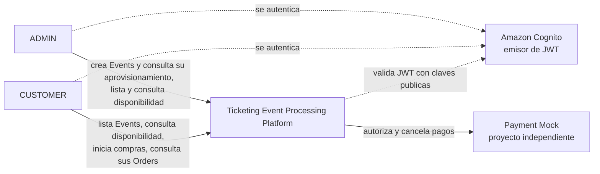

## 2. Contenedores y dependencias

Origen: [`ticketing.architecture.v2.md`](https://github.com/jtorres1990/PruebaeTecnicaNequi/blob/main/architecture/ticketing.architecture.v2.md) §4. Decisiones: ADR-022, ADR-029, ADR-034, ADR-036.

Una imagen con dos roles (`ticketing-api` y `ticketing-worker`), una tabla DynamoDB con cuatro índices, dos colas SQS con sus DLQ y el Payment Mock como contenedor propio. Es la misma forma que el entorno Docker Compose (ADR-036).

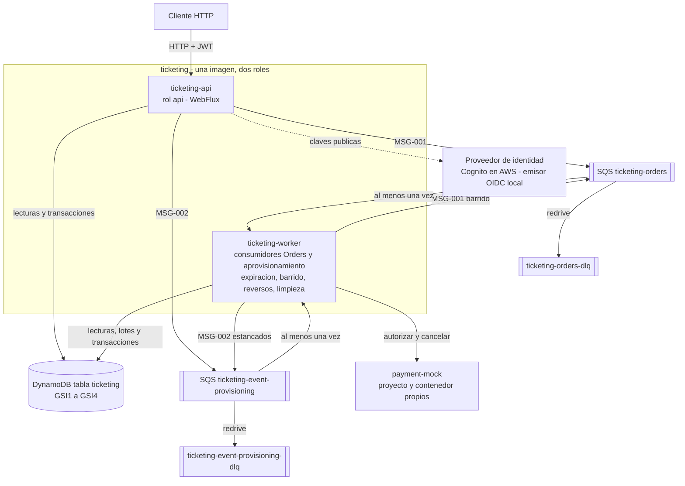

## 3. Creación y aprovisionamiento asíncrono de un Event (MF-001)

Origen: [`ticketing.architecture.v2.md`](https://github.com/jtorres1990/PruebaeTecnicaNequi/blob/main/architecture/ticketing.architecture.v2.md) §7.8. Decisiones: ADR-024, ADR-027, ADR-029.

La API responde 202 tras crear el Event en `PROVISIONING`; el `worker` escribe los Ticket por lotes con lease, verifica que existen exactamente `capacity` y habilita el Event. Colección: carpeta 02.

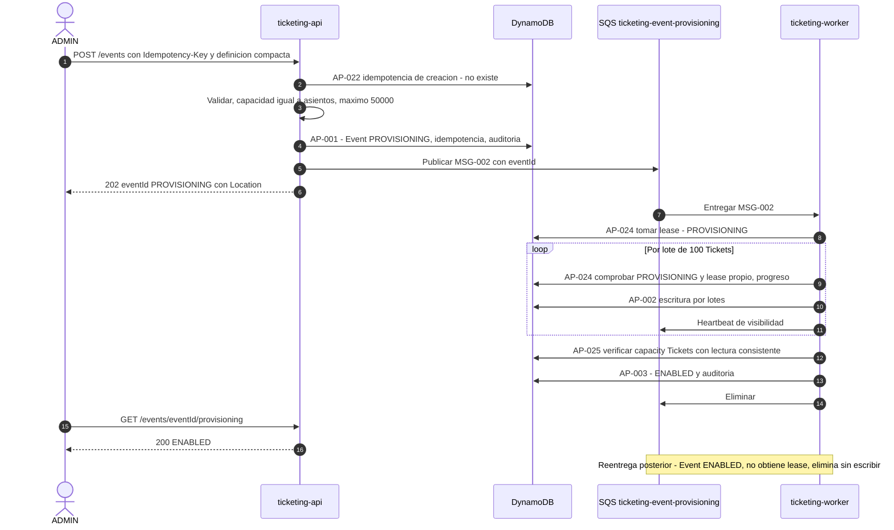

## 4. Compra: flujo feliz (MF-003)

Origen: [`ticketing.architecture.v2.md`](https://github.com/jtorres1990/PruebaeTecnicaNequi/blob/main/architecture/ticketing.architecture.v2.md) §7.1. Decisiones: ADR-023, ADR-025, ADR-026, ADR-027, ADR-032.

Reserva atómica de los Ticket, publicación del mensaje con presupuesto acotado y respuesta 201 sin esperar al pago; el `worker` cobra y confirma. Colección: carpeta 04.

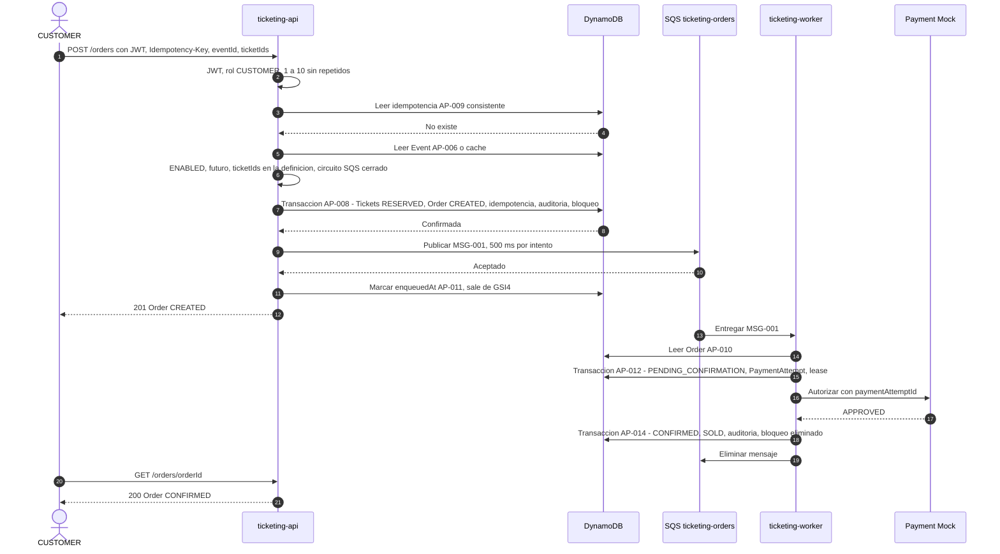

## 5. Compra: Ticket no disponible y Order activa existente

Origen: [`ticketing.architecture.v2.md`](https://github.com/jtorres1990/PruebaeTecnicaNequi/blob/main/architecture/ticketing.architecture.v2.md) §7.2. Decisiones: ADR-023, ADR-032, ADR-035.

Dos compras concurrentes sobre el mismo Ticket: una gana y la otra recibe 409 sin crear nada. Una segunda compra del mismo cliente en el mismo Event recibe `ACTIVE_ORDER_EXISTS`. Colección: 07.06 y 08.13.

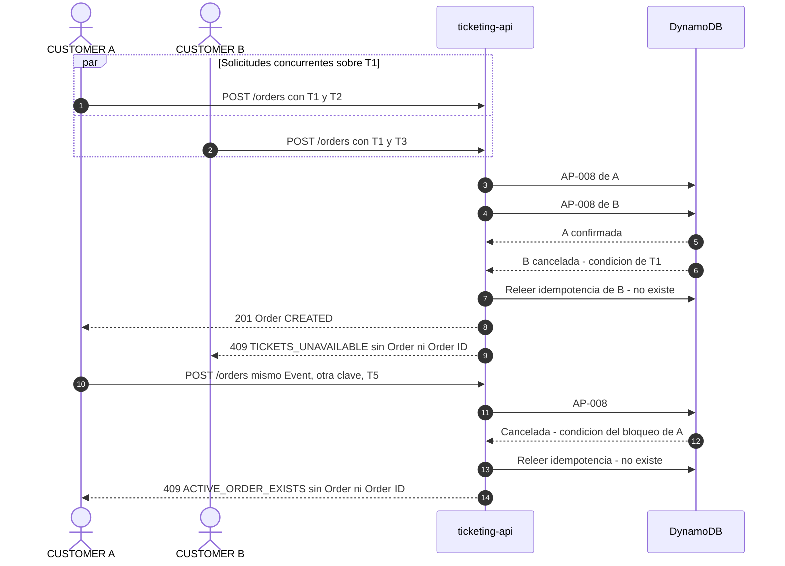

## 6. Compra: pago rechazado

Origen: [`ticketing.architecture.v2.md`](https://github.com/jtorres1990/PruebaeTecnicaNequi/blob/main/architecture/ticketing.architecture.v2.md) §7.3. Decisiones: ADR-025, ADR-030.

El rechazo cierra la Order como `REJECTED` y libera sus Ticket en la misma transacción. Colección: carpeta 05.

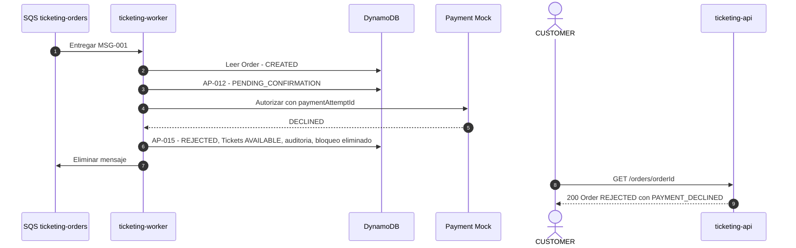

## 7. Fallo de encolado, circuito abierto y barrido de republicación

Origen: [`ticketing.architecture.v2.md`](https://github.com/jtorres1990/PruebaeTecnicaNequi/blob/main/architecture/ticketing.architecture.v2.md) §7.4. Decisiones: ADR-026, ADR-035.

Si la publicación falla de forma definitiva la Order queda `FAILED`; con el circuito de publicación abierto la compra recibe 503 sin reservar; el barrido republica Orders que quedaron sin mensaje. Procedimiento de resiliencia 3.

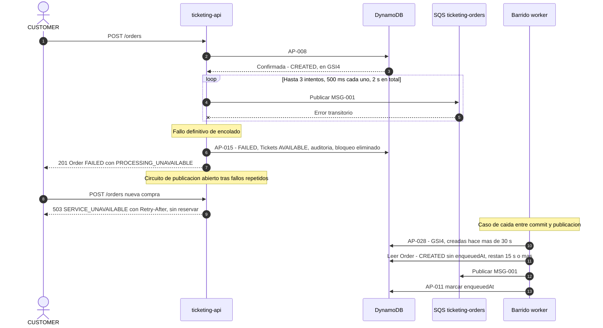

## 8. Mensaje duplicado

Origen: [`ticketing.architecture.v2.md`](https://github.com/jtorres1990/PruebaeTecnicaNequi/blob/main/architecture/ticketing.architecture.v2.md) §7.5. Decisiones: ADR-027, ADR-029.

Entrega al menos una vez: el lease del PaymentAttempt y el estado de la Order hacen que una entrega duplicada no repita el cobro. La colección no envía mensajes duplicados; 09.1 muestra una recepción pospuesta hasta el fin del lease y la reanudación del mismo PaymentAttempt.

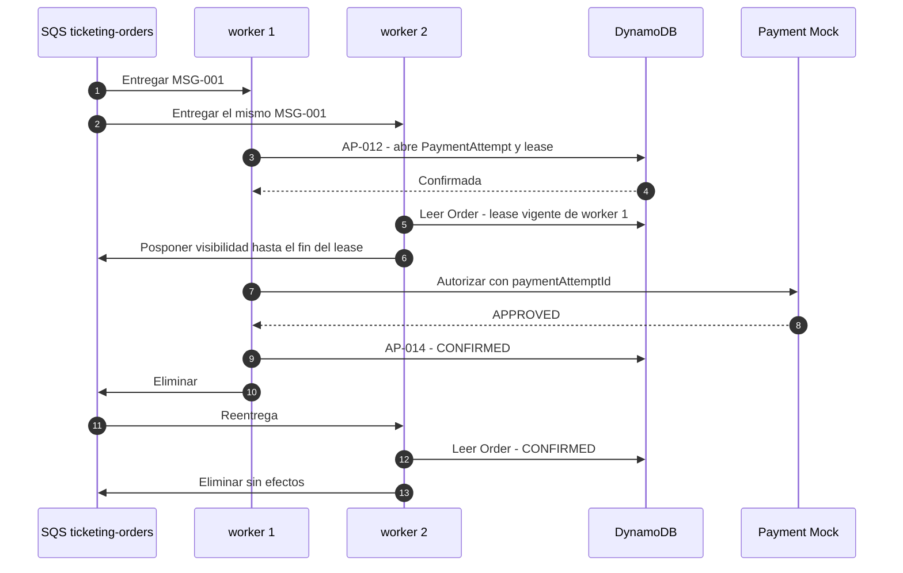

## 9. Expiración de la Reservation

Origen: [`ticketing.architecture.v2.md`](https://github.com/jtorres1990/PruebaeTecnicaNequi/blob/main/architecture/ticketing.architecture.v2.md) §7.6. Decisiones: ADR-028, ADR-025.

Proceso periódico cada 5 s, con planificación propia, que libera Reservation vencidas como máximo 15 s después de `expiresAt`.

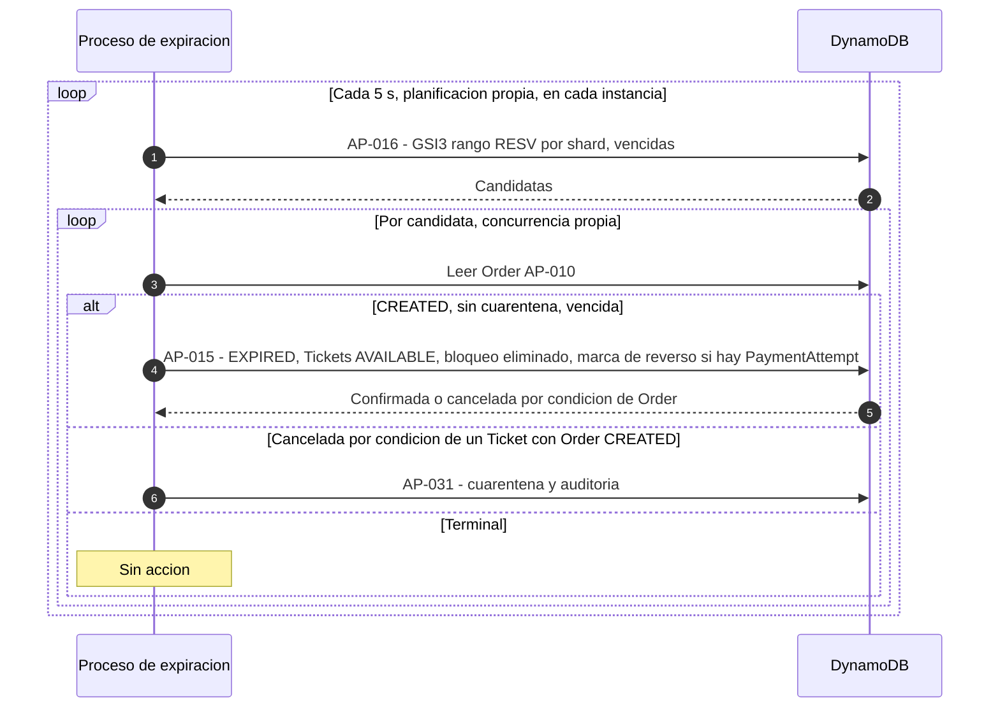

## 10. Carrera entre el pago y la expiración

Origen: [`ticketing.architecture.v2.md`](https://github.com/jtorres1990/PruebaeTecnicaNequi/blob/main/architecture/ticketing.architecture.v2.md) §7.7. Decisiones: ADR-008, ADR-025, ADR-030.

La Order es el guardián: confirmar y expirar compiten y exactamente una gana; una aprobación tardía no confirma y se reversa.

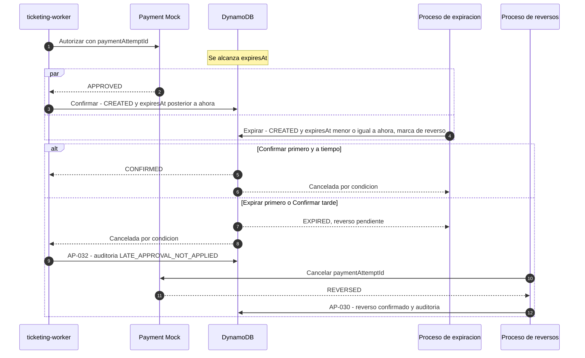

## 11. Reverso de pago con cancelación anticipada (MF-005)

Origen: [`ticketing.architecture.v2.md`](https://github.com/jtorres1990/PruebaeTecnicaNequi/blob/main/architecture/ticketing.architecture.v2.md) §7.9. Decisiones: ADR-025, ADR-030, ADR-031.

Una Order cerrada con resultado de pago desconocido queda marcada para reverso y el proceso de reversos cancela el intento. Colección: 09.2.

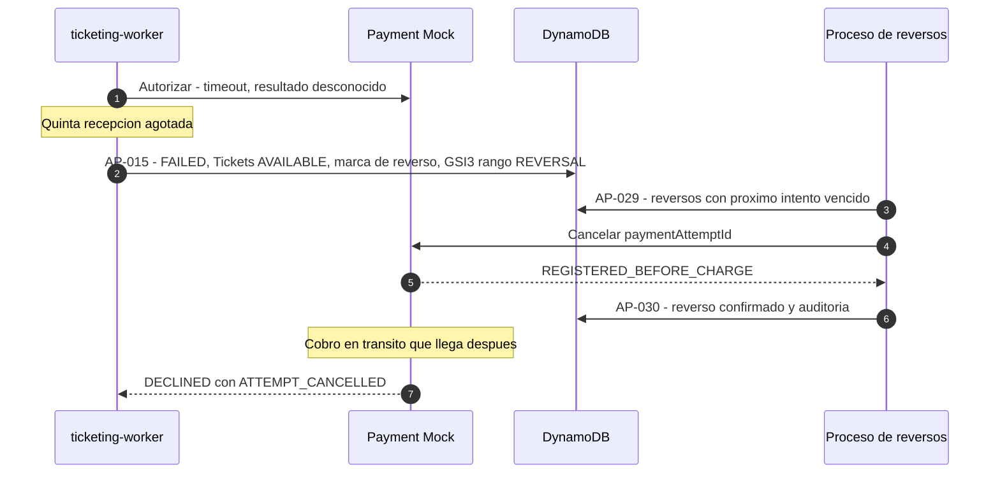

## 12. Carrera con la misma Idempotency-Key

Origen: [`ticketing.architecture.v2.md`](https://github.com/jtorres1990/PruebaeTecnicaNequi/blob/main/architecture/ticketing.architecture.v2.md) §7.10. Decisiones: ADR-027.

Dos solicitudes simultáneas con la misma clave producen una sola Order; la perdedora recibe la misma Order como repetición.

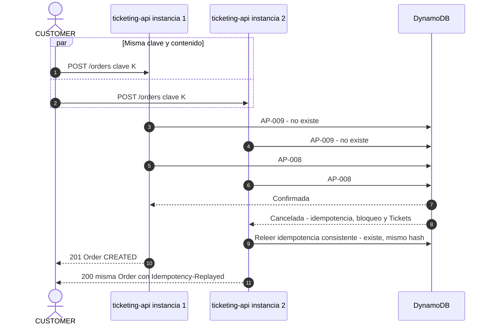

## 13. Caída del Payment Mock y circuit breaker

Origen: [`ticketing.architecture.v2.md`](https://github.com/jtorres1990/PruebaeTecnicaNequi/blob/main/architecture/ticketing.architecture.v2.md) §7.11. Decisiones: ADR-035, ADR-039, ADR-028.

Con el circuito abierto el consumo de Orders se pausa sin gastar recepciones y la expiración sigue. Procedimiento de resiliencia 2.

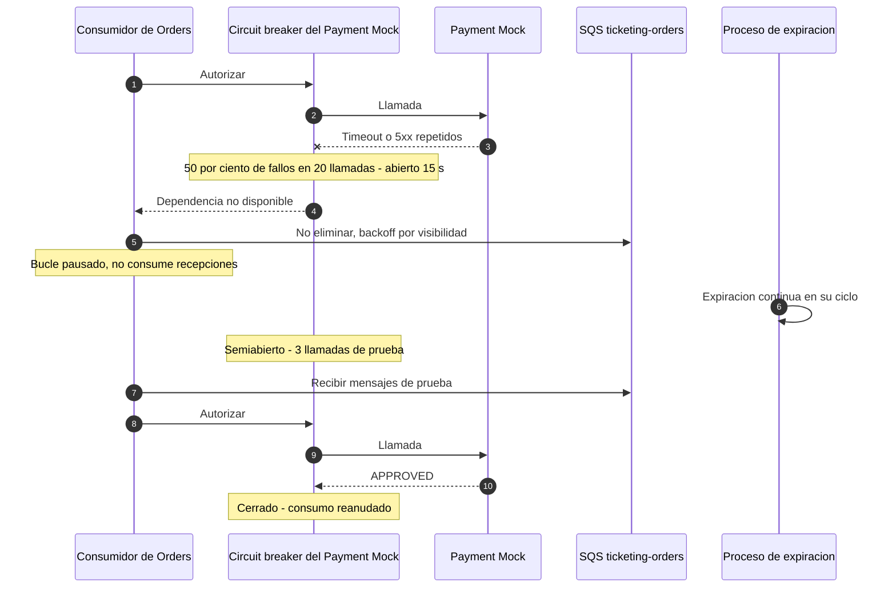

## 14. Topología objetivo en AWS (`Designed, not implemented`)

Origen: [`ticketing.aws-target.v2.md`](https://github.com/jtorres1990/PruebaeTecnicaNequi/blob/main/architecture/ticketing.aws-target.v2.md) §1. Decisiones: ADR-037.

Diseño aprobado, sin infraestructura como código ni despliegue: ECS Fargate con los servicios `api` y `worker`, ALB con WAF, VPC multi-AZ con endpoints privados, DynamoDB, SQS, Cognito, gestor de secretos y CloudWatch.

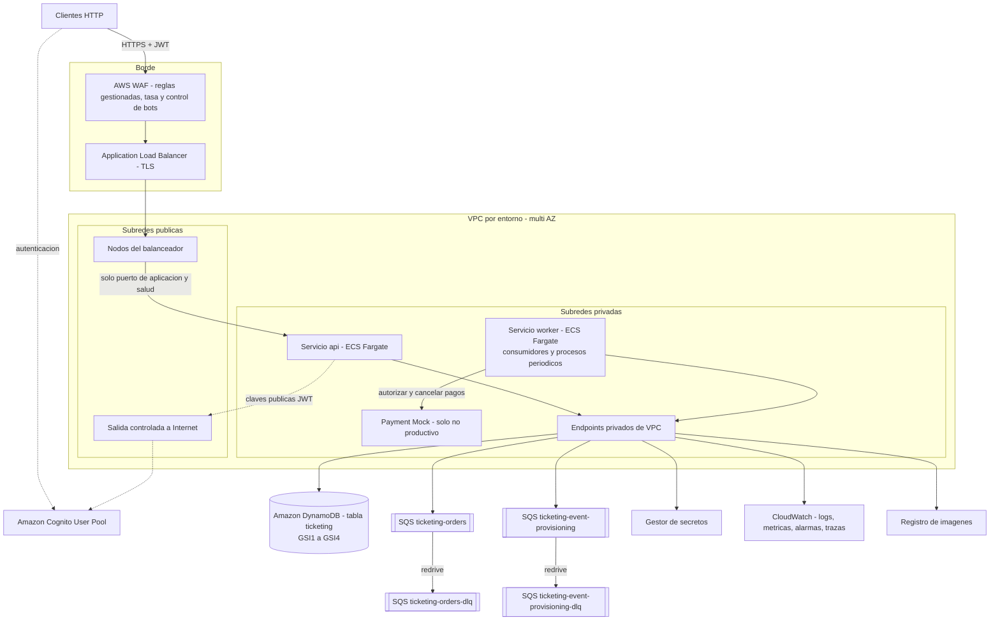
